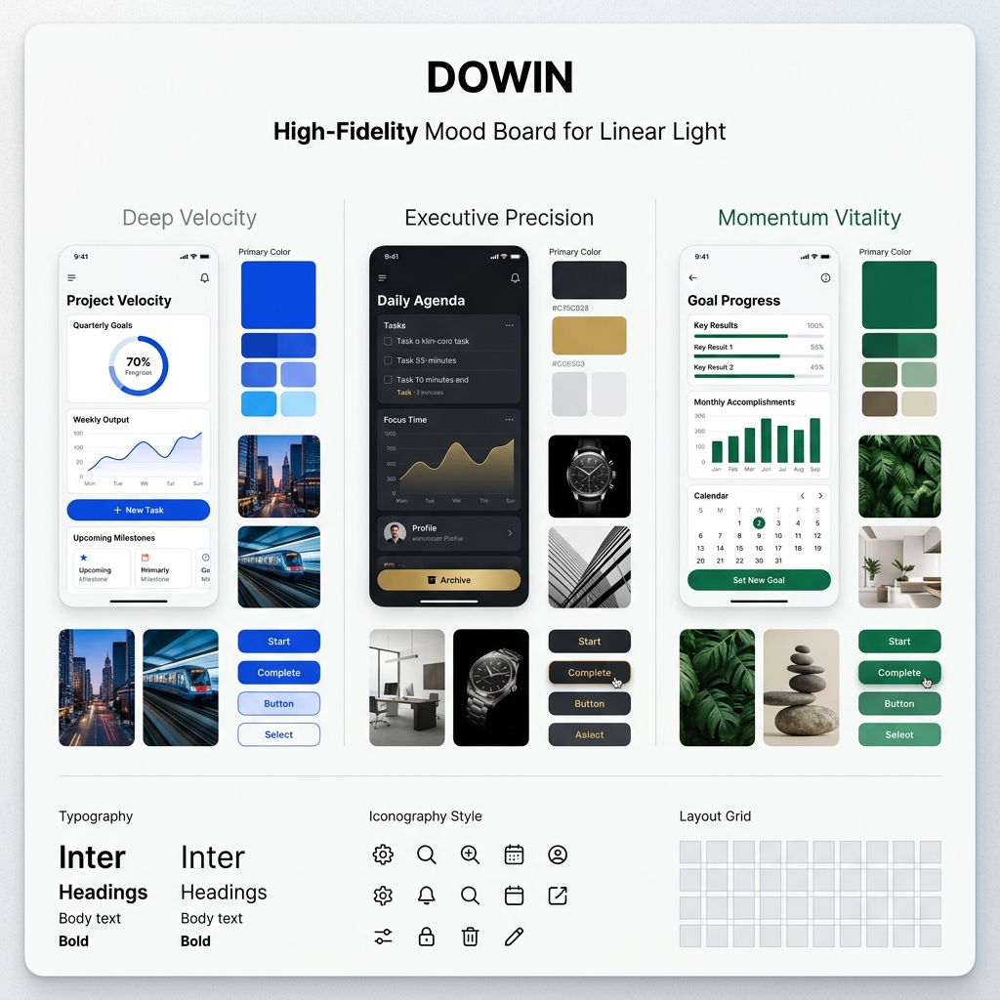
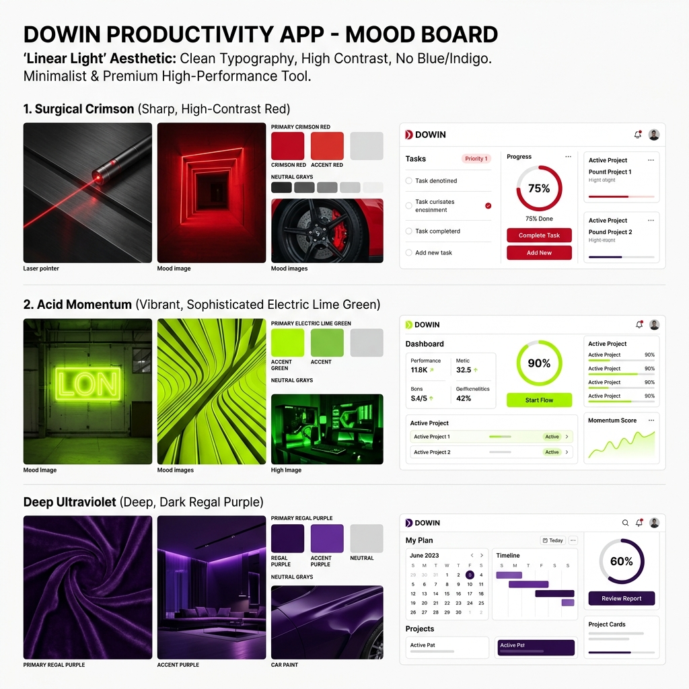
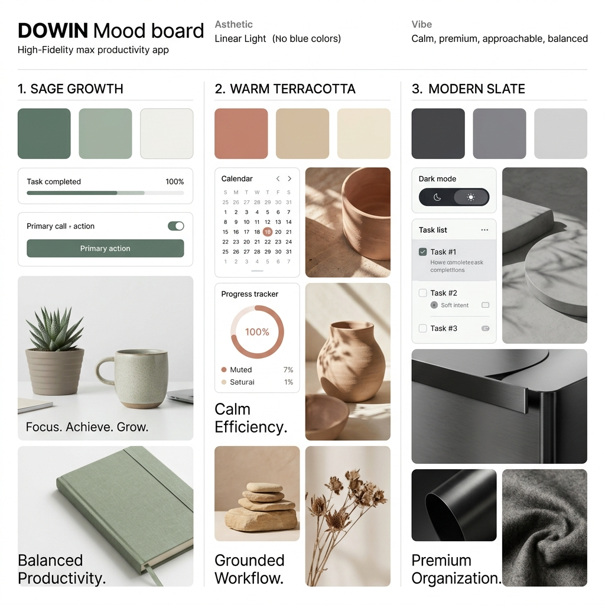
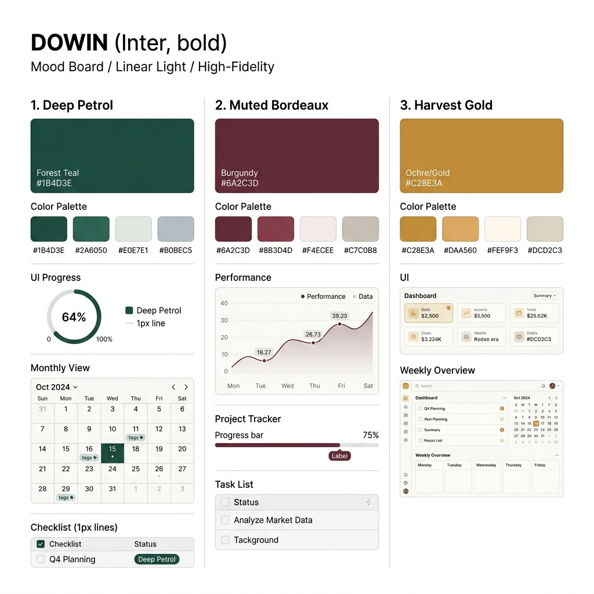
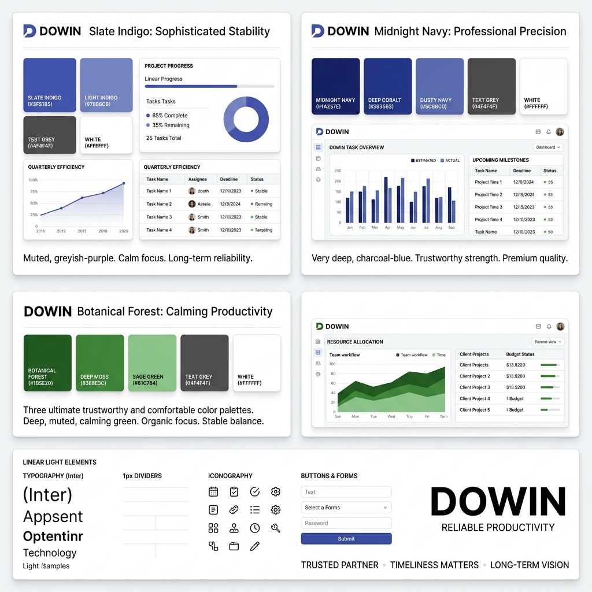
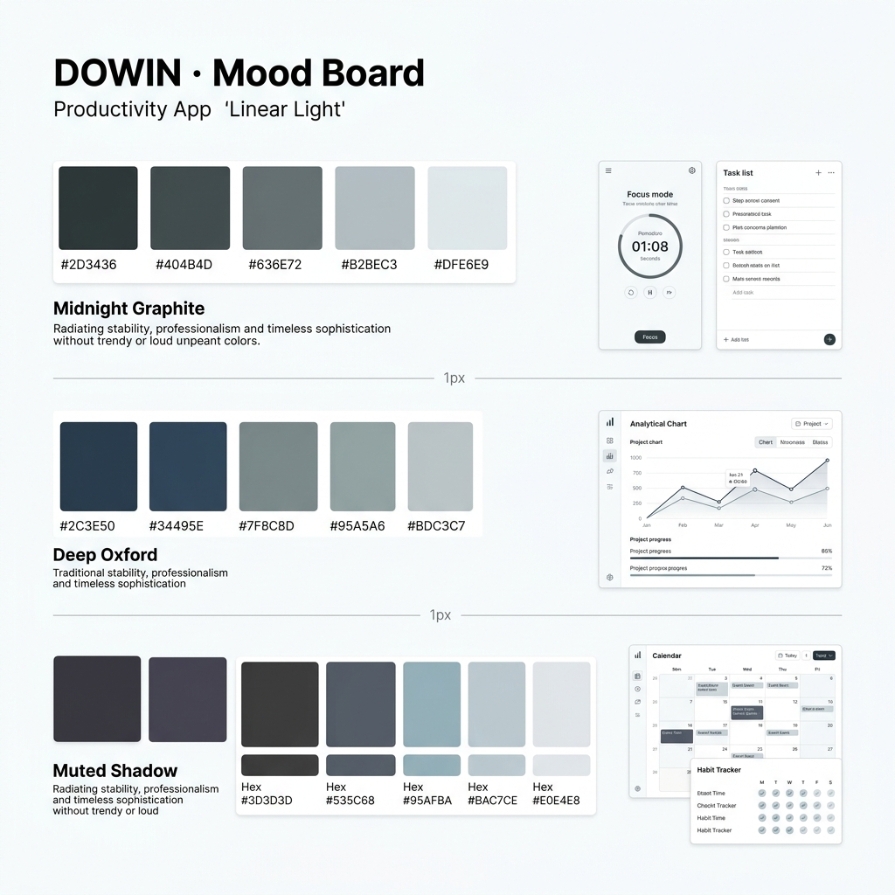
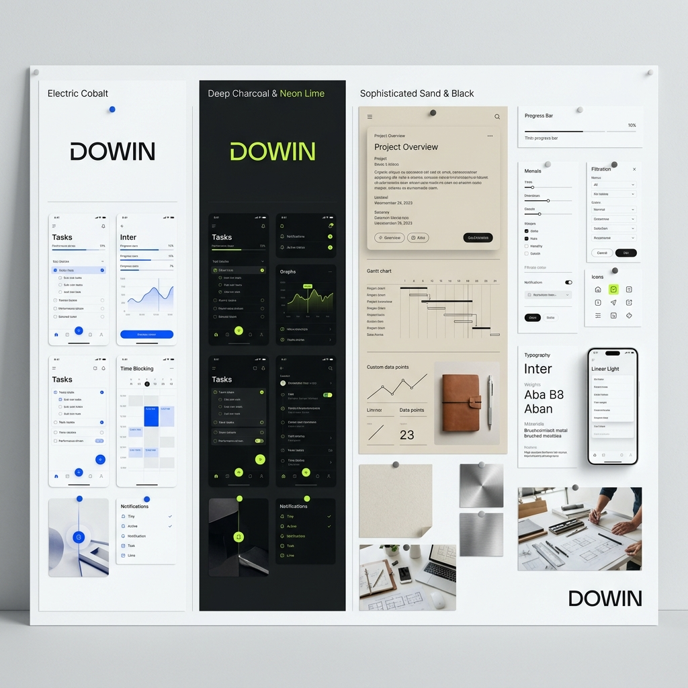
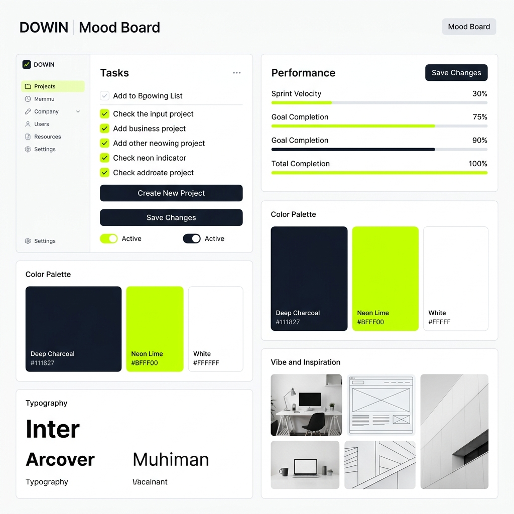

# Dowin 컬러 테마 제안서

이 문서는 "Linear Light" 브랜드 아이덴티티를 유지하면서, 서비스의 분위기를 새롭게 정의하기 위해 제안된 4가지 주요 컬러 전략과 12가지 세부 옵션을 정리한 리포트입니다.

## 1. 개요 (Overview)

- **목적**: 기존 Indigo 기반 브랜딩에서 탈피하여, 독창적이고 프리미엄한 사용자 경험(UX) 제공.
- **핵심 원칙**:
  - 화이트 배경 중심의 깨끗한 레이아웃 유지.
  - 1px 라인과 정교한 타이포그래피 강조.
  - 파란색 계열을 지양하고 서비스만의 독보적인 'Action Color' 발굴.
  - **Grayscale**: Tailwind CSS의 `Zinc` 계열을 기본 템플릿으로 유지.

---

## 2. 테마별 제안 세부 사항

### Theme A: Initial Premium Concepts



가장 정석적인 프리미엄 접근 방식으로, 성능과 고급스러움을 강조합니다.

- **Deep Velocity (Cobalt Blue)**: 고성능 도구의 정밀함.
- **Executive Precision (Obsidian/Gold)**: 명품 브랜드와 같은 권위와 무게감.
- **Momentum Vitality (Deep Emerald)**: 유기적인 성장과 에너지.

### Theme B: Bold & Distinct (Non-Blue)



파란색의 평범함을 완전히 거부하는 강렬하고 날카로운 대비의 컬러들입니다.

- **Surgical Crimson**: 레이저 같은 정교함과 강력한 집중력.
- **Acid Momentum**: 트렌디하고 미래지향적인 하이테크 감성.
- **Deep Ultraviolet**: 지적이고 신비로운 최고급 전문성.

### Theme C: Comfortable & Muted



눈의 피로도를 최소화하고 일상에 자연스럽게 스며드는 '저채도(Low-Saturation)' 컬러입니다.

- **Sage Growth**: 심리적 안정을 주는 성장의 컬러. (강력 추천)
- **Warm Terracotta**: 따뜻하고 지적인 라이프스타일 감성.
- **Modern Slate**: 질리지 않는 궁극의 미니멀리즘.

### Theme D: Intellectual Depth



단순한 관리를 넘어 사용자의 지적 가치를 높여주는 깊이 있는 컬러들입니다.

- **Deep Petrol**: 지적인 평온함과 딥 워크(Deep Work) 최적화.
- **Muted Bordeaux**: 품격 있는 성취와 성숙한 기록의 미학.
- **Harvest Gold**: 노력의 결실을 상징하는 풍요로운 가치.

### Theme E: Trust & Comfort (User Preferred Direction)



사용자의 피드백을 반영하여 '신뢰'와 '편안함'에 집중한 테마입니다. 기존 보라색의 정체성을 계승하면서도 훨씬 더 안정감 있는 분위기를 조성합니다.

- **Slate Indigo**: 기존 Indigo를 차분하게 정제한 버전. (유력 후보)
- **Midnight Navy**: 심해의 깊이감을 담은 견고한 네이비.
- **Botanical Forest**: 정서적 안정과 지속 가능한 성장을 돕는 숲색.

### Theme F: Ultimate Calm & Trust



'차분함'과 '신뢰감'을 극한으로 정제한 테마입니다. 색채를 최소화하고 깊이감 있는 어두운 톤을 사용하여 시간이 흘러도 변치 않는 가치를 지향합니다.

- **Midnight Graphite**: 흔들리지 않는 중심을 잡아주는 웜 차콜.
- **Deep Oxford**: 전통적인 지성과 권위가 느껴지는 로우 새튜레이션 네이비.
- **Muted Shadow**: 보라색의 매력을 그림자처럼 은은하게 재해석한 라벤더 차콜.

### Theme G: Pure Tech Modern



불필요한 장식을 걷어내고 본질적인 대비와 정갈한 톤에 집중한 테마입니다. 선명한 액센트와 무채색의 조화로 현대적인 전문성을 강조합니다.

- **Electric Cobalt**: 가장 맑고 투명한 신뢰를 주는 코발트 블루.
- **Deep Charcoal & Neon Lime**: 다크 모드의 세련미와 번뜩이는 지성을 담은 조합.
- **Sophisticated Sand & Black**: 라이프스타일 브랜드 같은 우아한 무게감을 주는 샌드 베이지.

### Theme H: Deep Contrast & Neon (Expert's Choice)



사용자의 분석적 통찰을 반영한 전략입니다. 버튼 등 주요 액션 요소에는 고대비의 어두운 컬러를 사용하고, 네온 라임을 액센트로만 활용하여 시인성과 세련미를 동시에 확보합니다.

- **Deep Charcoal (Slate 950)**: 하얀 텍스트와 완벽한 대비를 이루는 버튼 컬러.
- **Neon Lime Accent**: 진행 바, 활성 상태, 체크박스 등에만 사용되는 포인트 컬러.
- **Surgical Precision**: 대중적인 서비스를 넘어 '프로 전용 도구'의 느낌을 극대화함.

---

## 3. 적용 방법 (Implementation)

선택된 테마의 `Primary` 컬러 값은 `src/app/globals.css`의 `--color-primary` 변수에 적용됩니다.

```css
/* 예시: Deep Contrast (Slate 950) 적용 시 */
:root {
  --color-primary: rgba(15, 23, 42, 1);
  --color-primary-light: rgba(30, 41, 59, 1);
  --color-accent: rgba(163, 230, 53, 1);
}
```
