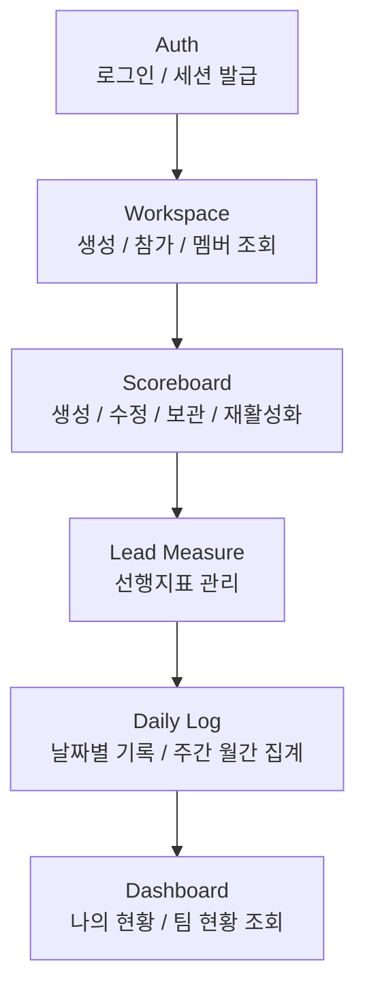
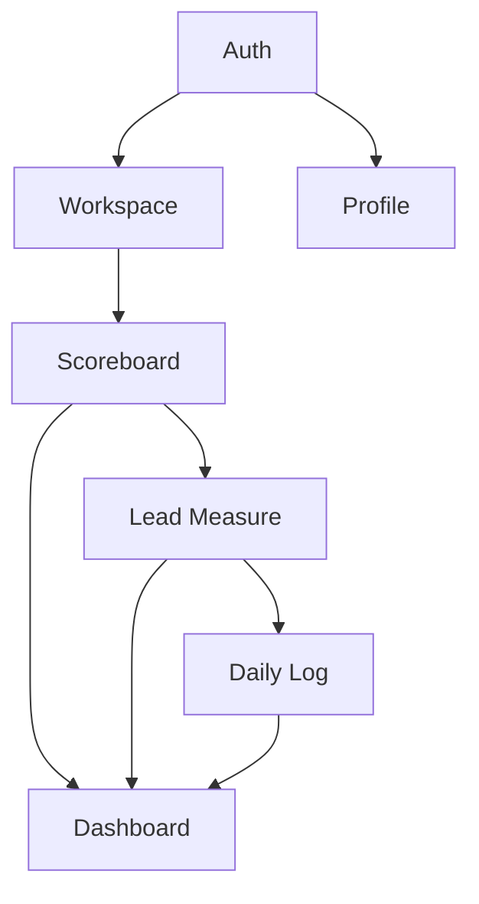
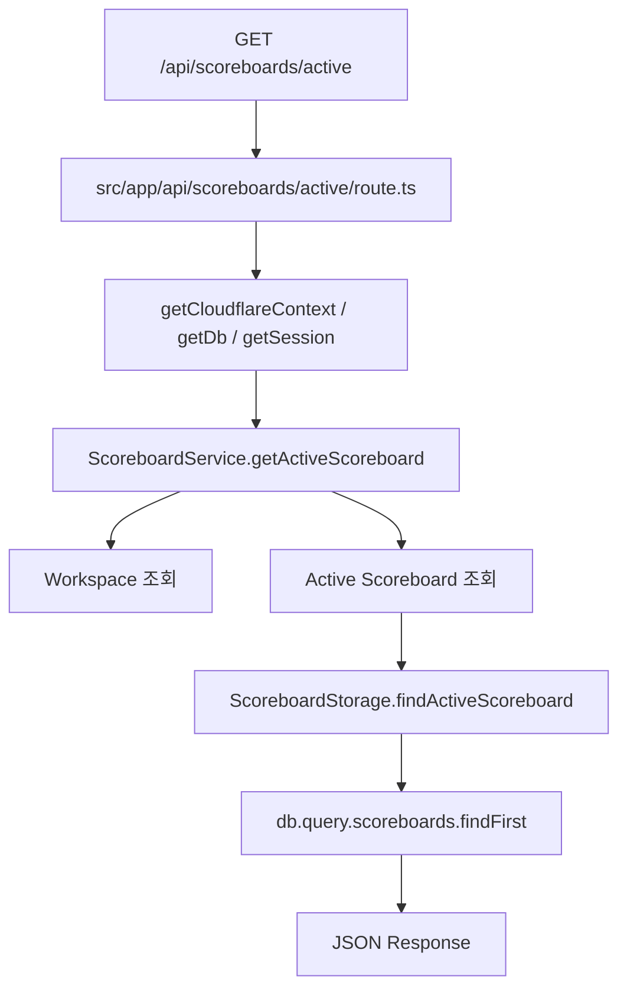
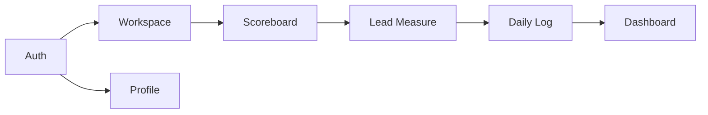
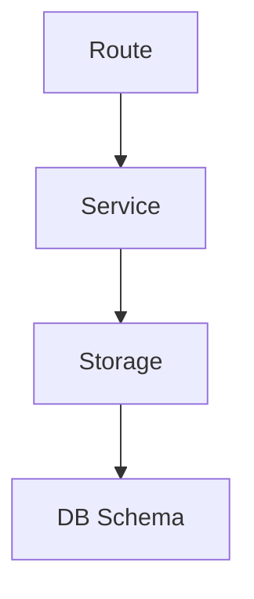
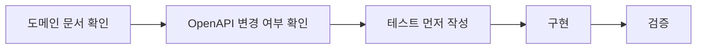
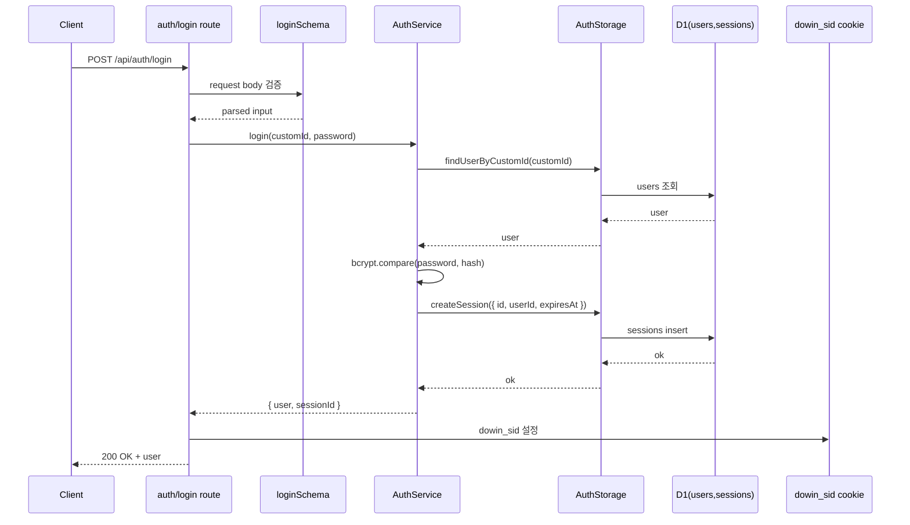
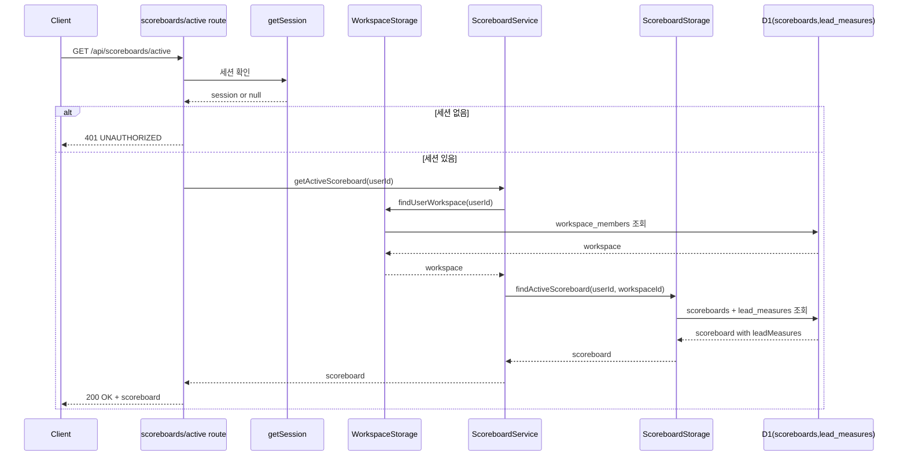
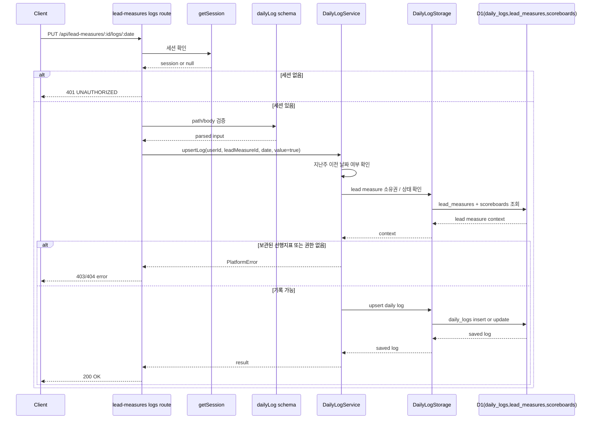
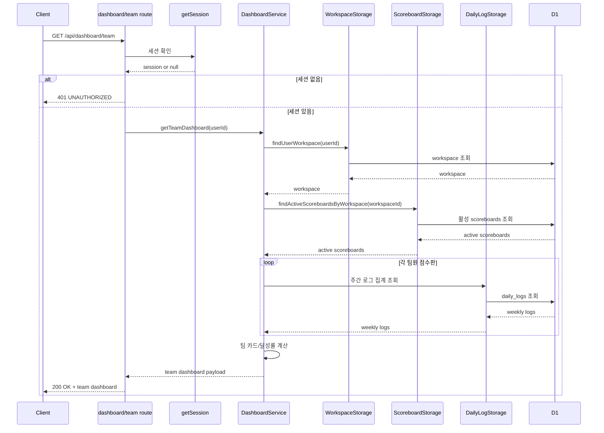

# Dowin 백엔드 온보딩

## 1. 이 문서의 역할

이 문서는 Dowin 백엔드 코드를 처음 접하는 개발자가 아래 질문에 빠르게 답할 수 있도록 만든 시작 문서다.

- 이 서비스는 어떤 흐름으로 동작하는가
- 백엔드 도메인은 어떤 순서로 이어지는가
- 요청은 코드에서 어디를 따라가면 되는가
- 무엇부터 읽어야 하고 어디를 고쳐야 하는가

자세한 정책과 구현 이력은 각 도메인 문서를 보고, 이 문서는 전체 지도를 잡는 용도로 사용한다.

## 2. 제품 흐름 한눈에 보기

```text
[Auth]
  로그인 / 세션 발급
      |
      v
[Workspace]
  워크스페이스 생성 / 참가 / 멤버 조회
      |
      v
[Scoreboard]
  활성 점수판 생성 / 수정 / 보관 / 재활성화
      |
      v
[Lead Measure]
  점수판에 속한 선행지표 관리
      |
      v
[Daily Log]
  날짜별 기록 생성 / 삭제
  주간 / 월간 집계 조회
      |
      v
[Dashboard]
  나의 현황 / 팀 현황 조회
```

사용자 흐름으로 풀면 아래 순서다.

1. 로그인한다.
2. 워크스페이스를 만들거나 참가한다.
3. 활성 점수판을 만든다.
4. 선행지표를 추가한다.
5. 날짜별로 기록한다.
6. 대시보드에서 이번 주와 이번 달 흐름을 확인한다.

### Mermaid 버전



## 3. 도메인 의존 관계

```text
auth
 └─ 로그인 성공 후 접근 가능
    ├─ workspace
    │   └─ workspace가 있어야 scoreboard 가능
    │       └─ scoreboard가 있어야 lead-measure 가능
    │           └─ lead-measure가 있어야 daily-log 가능
    │               └─ dashboard는 scoreboard + lead-measure + daily-log를 읽는다
    └─ profile
```

정리하면 `auth -> workspace -> scoreboard -> lead-measure -> daily-log -> dashboard` 순서로 읽는 것이 가장 자연스럽다.  
`profile`은 비교적 독립적이라 뒤에 봐도 된다.

### Mermaid 버전



## 4. 백엔드 레이어 구조

Dowin 백엔드는 비교적 명확한 계층 구조를 유지한다.

```text
HTTP Request
   |
   v
Route Handler
src/app/api/**/route.ts
   - 세션 확인
   - Zod 입력 검증
   - Service 호출
   - apiSuccess / apiError 반환
   |
   v
Service
src/domain/*/services/*.ts
   - 비즈니스 규칙
   - 상태 전이
   - 권한 / 소유권 검증
   |
   v
Storage
src/domain/*/storage/*.ts
   - Drizzle ORM 기반 DB 접근
   - 테이블 CRUD
   |
   v
DB Schema
src/db/schema.ts
```

핵심 원칙은 아래와 같다.

- 라우트는 얇게 유지한다.
- 비즈니스 규칙은 서비스에 둔다.
- DB 접근은 스토리지에 둔다.
- 입력 검증은 `validation.ts`의 Zod 스키마로 처리한다.
- 응답은 `apiSuccess`, `apiError`, `withErrorHandler` 패턴을 사용한다.

## 5. 실제 요청 흐름 예시

점수판 조회 하나만 따라가도 이 저장소 구조가 거의 다 보인다.

```text
GET /api/scoreboards/active
   |
   v
src/app/api/scoreboards/active/route.ts
   |
   |-- getCloudflareContext()
   |-- getDb(env.DB)
   |-- getSession(db)
   |-- new ScoreboardService(...)
   v
src/domain/scoreboard/services/scoreboard.service.ts
   |
   |-- 현재 사용자의 workspace 조회
   |-- active scoreboard 조회
   |-- 없으면 NotFoundError
   v
src/domain/scoreboard/storage/scoreboard.storage.ts
   |
   |-- db.query.scoreboards.findFirst(...)
   v
JSON Response
```

즉, 새 API를 읽거나 만들 때는 항상 `route -> service -> storage -> schema` 순서로 따라가면 된다.

### Mermaid 버전



## 6. 핵심 파일 지도

```text
src/
├─ app/api/                  # Next Route Handlers
│  ├─ auth/
│  ├─ workspaces/
│  ├─ scoreboards/
│  ├─ lead-measures/
│  ├─ dashboard/
│  └─ users/me/
│
├─ domain/                   # 도메인별 서비스 / 스토리지 / 검증
│  ├─ auth/
│  ├─ workspace/
│  ├─ scoreboard/
│  ├─ lead-measure/
│  ├─ daily-log/
│  ├─ dashboard/
│  └─ profile/
│
├─ lib/server/               # 서버 공통 유틸
│  ├─ auth.ts
│  ├─ api-response.ts
│  ├─ errors.ts
│  └─ with-error-handler.ts
│
└─ db/
   ├─ index.ts
   └─ schema.ts
```

특히 처음에는 아래 파일을 먼저 보는 것이 좋다.

- `src/lib/server/auth.ts`
- `src/lib/server/api-response.ts`
- `src/lib/server/with-error-handler.ts`
- `src/db/schema.ts`
- `src/app/api/auth/login/route.ts`
- `src/domain/auth/services/auth.service.ts`
- `src/domain/auth/storage/auth.storage.ts`
- `src/app/api/scoreboards/active/route.ts`
- `src/domain/scoreboard/services/scoreboard.service.ts`
- `src/domain/scoreboard/storage/scoreboard.storage.ts`

## 7. 추천 읽기 순서

처음부터 모든 도메인을 평평하게 보면 구조가 안 잡힌다. 아래 순서로 끊어서 읽는 것이 효율적이다.

### 7.1. 문서

1. `README.md`
2. `docs/onboarding.md`
3. `.agents/skills/backend/SKILL.md`
4. `docs/dev/common/2026.03.12-domain-overview.md`
5. `docs/dev/common/2026.03.12-api-conventions.md`
6. `docs/dev/common/2026.03.14-common-utilities.md`
7. 작업할 도메인의 설계/구현 문서

### 7.2. 코드

1. `src/lib/server/*`
2. `src/db/schema.ts`
3. `auth`
4. `workspace`
5. `scoreboard`
6. `lead-measure`
7. `daily-log`
8. `dashboard`
9. `profile`

## 8. 도메인별 학습 포인트

### 8.1. Auth

- 세션 쿠키 이름은 `dowin_sid`다.
- 로그인 성공 시 D1 `sessions` 테이블과 HttpOnly 쿠키를 함께 사용한다.
- 인증이 필요한 라우트는 `getSession(db)`로 세션을 확인한다.

### 8.2. Workspace

- 사용자 1명은 MVP 기준 하나의 워크스페이스에 속한다.
- 점수판 생성 전에는 먼저 워크스페이스가 있어야 한다.
- 권한은 `ADMIN`, `MEMBER` 두 가지다.

### 8.3. Scoreboard

- `user_id + workspace_id` 기준 `ACTIVE` 점수판은 하나만 허용된다.
- 상태 전이는 `ACTIVE -> ARCHIVED -> ACTIVE` 흐름을 가진다.
- 선행지표는 점수판에 종속된다.

### 8.4. Lead Measure

- 점수판이 활성 상태일 때만 관리 가능하다.
- `ACTIVE | ARCHIVED` 상태를 가진다.
- 일간 기록의 기준 엔티티다.

### 8.5. Daily Log

- `(lead_measure_id, log_date)`는 유일하다.
- 지난주부터의 과거 날짜는 수정할 수 없다.
- 미래 날짜 기록은 금지다.
- 현재 제품 흐름은 `미기록 <-> O` 토글 중심이다.

### 8.6. Dashboard

- My View는 별도 전용 집계 엔드포인트가 아니라 여러 API 조합으로 구성된다.
- Team View는 같은 워크스페이스의 활성 점수판들을 읽기 모델처럼 집계한다.

## 9. 백엔드 개발 규칙

백엔드 변경 시 기본 원칙은 아래와 같다.

```text
도메인 문서 확인
   ->
OpenAPI 계약 변경 여부 확인
   ->
테스트 먼저 작성
   ->
Route / Service / Storage 구현
   ->
관련 테스트 실행
   ->
필요 시 gen:api / eslint / 타입 확인
```

꼭 기억할 규칙은 아래와 같다.

- 패키지 매니저는 `yarn`만 사용한다.
- 신규 API 또는 계약 변경 시 `src/api-spec/openapi.yaml`을 먼저 수정한다.
- 입력 검증은 Zod를 사용한다.
- 에러 처리는 `PlatformError` 계층과 공통 응답 규격을 따른다.
- DB 접근은 Drizzle ORM을 사용한다.
- 백엔드 작업은 `.agents/skills/backend/SKILL.md`와 해당 reference 규칙을 따른다.

## 10. 현재 실무적으로 알아둘 점

- 현재 `yarn tsc --noEmit`, `yarn lint`, `yarn test:server`는 기본 백엔드 품질 게이트로 사용할 수 있다.
- 전체 콘솔 테스트는 `yarn test --run`이며, Storybook browser 테스트는 별도 `yarn test:storybook --run`으로 분리돼 있다.
- 따라서 평소에는 변경 범위 기준 테스트부터 시작하고, 영향 범위가 크면 전역 게이트까지 넓히면 된다.
- 문서와 코드가 다르면 현재 구현 파일을 우선 본다.

## 11. 첫 주 추천 루틴

```text
Day 1
  공통 문서 + auth

Day 2
  workspace + scoreboard

Day 3
  lead-measure + daily-log

Day 4
  dashboard 집계 흐름

Day 5
  작은 버그 하나를 테스트 먼저 써서 수정
```

추천하는 첫 실습은 아래 둘 중 하나다.

- validation 규칙 하나를 테스트로 추가해보기
- 기존 API 하나를 `route -> service -> storage` 순서로 직접 추적해서 메모 남기기

## 12. 빠른 참조 문서

- 전체 온보딩: `docs/onboarding.md`
- 개발자 시작 문서: `docs/dev/README.md`
- 전체 도메인 구조: `docs/dev/common/2026.03.12-domain-overview.md`
- API 규약: `docs/dev/common/2026.03.12-api-conventions.md`
- 공통 유틸: `docs/dev/common/2026.03.14-common-utilities.md`
- 백엔드 스킬: `.agents/skills/backend/SKILL.md`

이 문서로 전체 구조를 잡은 뒤에는, 실제 작업 도메인의 설계 문서와 구현 파일로 바로 내려가면 된다.

## 부록. Mermaid 모음

문서를 빠르게 훑을 때는 아래 세 개만 봐도 전체 구조가 들어온다.







## 부록. API 엔드포인트별 시퀀스 다이어그램

아래 다이어그램은 실제 백엔드 요청이 어떤 레이어를 거치는지 빠르게 익히기 위한 참조용이다.

### 1. POST `/api/auth/login`



### 2. GET `/api/scoreboards/active`



### 3. PUT `/api/lead-measures/:id/logs/:date`



### 4. GET `/api/dashboard/team`


