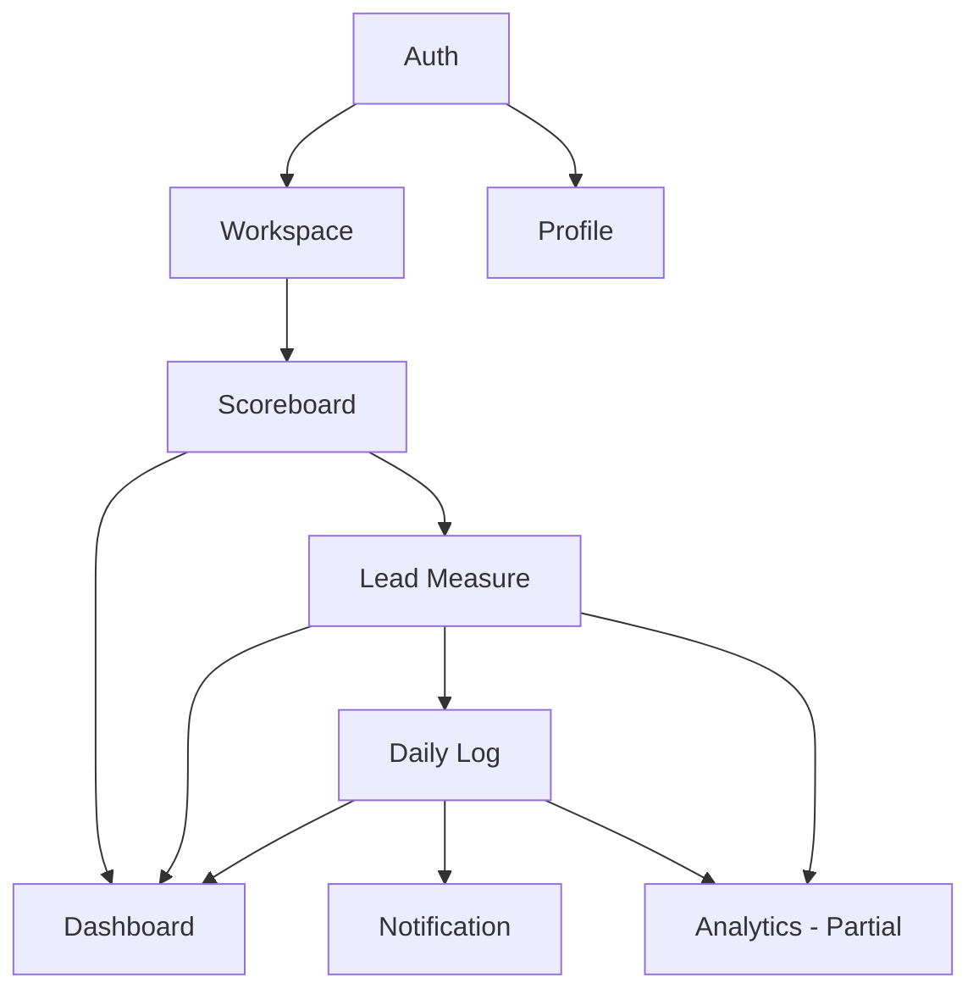

# DOWIN 전체 도메인 개요

## 1. 도메인 목록

| #   | 도메인 ID      | 도메인명        | MVP          | 설계 문서                |
| --- | -------------- | --------------- | ------------ | ------------------------ |
| 1   | `auth`         | 인증            | ✅           | `domain-auth.md`         |
| 2   | `workspace`    | 워크스페이스    | ✅           | `domain-workspace.md`    |
| 3   | `scoreboard`   | 가중목 / 점수판 | ✅           | `domain-scoreboard.md`   |
| 4   | `lead-measure` | 선행지표        | ✅           | `domain-lead-measure.md` |
| 5   | `daily-log`    | 주간 기록       | ✅           | `domain-daily-log.md`    |
| 6   | `dashboard`    | 대시보드        | ✅           | `domain-dashboard.md`    |
| 7   | `profile`      | 프로필 / 설정   | ✅           | `domain-profile.md`      |
| 8   | `notification` | 알림            | ✅           | `domain-notification.md` |
| 9   | `analytics`    | 분석 / 통계     | 🟡 부분 구현 | `domain-analytics.md`    |

---

## 2. 도메인 책임 정의

### 2.1. Auth (인증)

- **책임**: 사용자 신원 확인 및 세션 관리
- **주요 엔티티**: `User`, `Session`
- **핵심 규칙**:
  - 공개 회원가입(Self-signup)과 관리자용 멤버 생성 API를 함께 지원한다.
  - 가입 직후 복원코드 8개를 1회 발급하고, 복원코드 기반 계정 조회/비밀번호 재설정을 지원한다.
  - 관리자 생성 계정은 운영 편의를 위한 보조 경로로 유지한다.
  - 서버 사이드 세션 + HttpOnly 쿠키 기반 세션 관리.

### 2.2. Workspace (워크스페이스)

- **책임**: 팀(모임) 단위의 공간 생성, 참가, 멤버십 관리
- **주요 엔티티**: `Workspace`, `WorkspaceMember`, `WorkspaceTag`
- **핵심 규칙**:
  - 현재는 사용자 1명당 1개 워크스페이스 가입 정책을 유지한다.
  - 사용자는 직접 워크스페이스를 생성하거나 초대코드로 참가할 수 있다.
  - ADMIN은 초대코드와 멤버십을 관리한다.
  - 역할: `ADMIN`, `MEMBER`

### 2.3. Scoreboard (가중목 / 점수판)

- **책임**: DOWIN(가중목)와 후행지표(Lag Measure)를 포함하는 점수판의 생명주기 관리
- **주요 엔티티**: `Scoreboard`
- **핵심 규칙**:
  - `user_id + workspace_id` 조합당 `ACTIVE` 상태의 점수판은 **단 하나**.
  - 상태 전이: `ACTIVE` → `ARCHIVED`. 종료 후에만 새 점수판 생성 가능.
  - 후행지표(Lag Measure)는 점수판 레코드 내 텍스트 필드로 관리 (별도 테이블 없음, MVP).

### 2.4. Lead Measure (선행지표)

- **책임**: 점수판에 속하는 실행 가능한 세부 행동 지표 관리
- **주요 엔티티**: `LeadMeasure`, `LeadMeasureTag`
- **핵심 규칙**:
  - 점수판이 `ACTIVE` 상태일 때만 추가/수정/삭제 가능.
  - 소프트 삭제 대신 `status: ACTIVE | ARCHIVED` 필드로 관리.
  - 삭제(물리적)는 번들 내 히스토리 전체 제거를 의미.
  - 선행지표는 워크스페이스 공용 태그를 최대 3개까지 연결할 수 있다.

### 2.5. Daily Log (주간 기록)

- **책임**: 선행지표에 대한 날짜별 O/X 달성 기록
- **주요 엔티티**: `DailyLog`
- **핵심 규칙**:
  - `(lead_measure_id, log_date)` 조합은 유일(Unique). 중복 기록 불가.
  - 이번 주(월요일~일요일) 날짜만 기록/수정 가능.
  - 지난주부터의 과거 날짜는 수정할 수 없음.
  - 미래 날짜 기록은 허용하지 않음.

### 2.6. Dashboard (대시보드)

- **책임**: 나의 주간/월간 점수판 현황과 팀원 현황, 팀 메모 흐름을 종합적으로 시각화
- **주요 엔티티**: (읽기 전용 집계. 별도 엔티티 없음)
- **핵심 규칙**:
  - 뷰 토글: `나의 지표 (My View)` ↔ `팀 전체 뷰 (Team View)`
  - 현재 My View는 별도 `/api/dashboard/me` 집계 엔드포인트가 아니라 활성 점수판 조회와 주간/월간 로그 조회 조합으로 구성된다.
  - My View는 `view`, `date` query를 기준으로 주간/월간 탐색을 지원한다.
  - 팀 뷰는 이번 주 선행지표 달성 현황만 노출 (개인 세부 히스토리 비공개).
  - 팀 뷰는 사용자별 메모 조회/생성/완료/삭제와 메모 레일 UX를 제공한다.
  - 점수판이 없는 유저에게는 '새 점수판 만들기' CTA 노출.

### 2.7. Profile (프로필 / 설정)

- **책임**: 사용자의 개인 정보(닉네임, avatarKey)와 개인 설정 진입점 관리
- **주요 엔티티**: `User` (쓰기)
- **핵심 규칙**:
  - 닉네임은 워크스페이스 내 중복 가능 (식별은 user_id로).
  - 현재 활성 API는 조회/수정 중심이며, 계정 탈퇴는 아직 구현되지 않았다.

### 2.8. Notification (알림)

- **책임**: 기록 리마인드를 위한 푸시 알림 구독 및 발송 관리
- **주요 엔티티**: `DevicePushToken`
- **핵심 규칙**:
  - 앱(WebView) 전용 FCM 디바이스 토큰 기반.
  - 매일 밤 9시 기록 리마인드 알림.
  - 매주 목요일 오후 3시 집중 리마인드 알림.
  - 사용자가 직접 알림 on/off 제어.

### 2.9. Analytics (분석 / 통계)

- **책임**: 기간별 달성률 집계와 export 데이터 제공. 차트 시각화와 AI 실행계획 리뷰는 후속 범위
- **주요 엔티티**: (집계 쿼리. 별도 엔티티 없음)
- **핵심 규칙**:
  - 현재 구현은 `GET /api/analytics/export-data` 중심이다.
  - 차트 시각화와 AI 실행계획 리뷰는 아직 구현되지 않았다.

---

## 3. 도메인 간 의존 관계

```
Auth
 └─ 인증 성공 시 → Workspace, Profile 접근 가능

Workspace
 └─ ADMIN이 생성 → 초대 코드 배포
 └─ MEMBER 참가 → Scoreboard 생성 가능

Scoreboard (활성)
 └─ LeadMeasure 관리 가능
    └─ DailyLog 기록 가능

Dashboard
 └─ Scoreboard + LeadMeasure + DailyLog 집계 (읽기)

Analytics
 └─ DailyLog 집계 (읽기)
 └─ LeadMeasure 메타 (읽기)

Notification
 └─ User, DailyLog 기반 트리거

Profile
 └─ User 엔티티 직접 수정
```



---

## 4. 이벤트 흐름 (핵심 시나리오)

### 시나리오 A: 신규 사용자 온보딩

```
1. 사용자가 직접 회원가입하거나 ADMIN이 계정을 생성 (Auth)
2. 가입 직후 복원코드 저장, 이후 로그인 시 세션 쿠키 발급 (Auth)
3. 워크스페이스 생성 또는 초대코드 참가 (Workspace)
4. 점수판 생성: DOWIN + Lag Measure 입력 (Scoreboard)
5. 선행지표 추가: 4DX 가이드와 함께 (Lead Measure)
6. 대시보드 진입: 주간 점수판 기록 시작 (Dashboard + Daily Log)
```

### 시나리오 B: 매일 기록

```
1. 저녁 9시 PWA 푸시 알림 수신 (Notification)
2. 대시보드 접속 → 주간 점수판 확인 (Dashboard)
3. 선행지표 O/X 토글 (Daily Log)
4. 달성 시 Confetti 축하 애니메이션
```

### 시나리오 C: 주간 회의 (Meeting Mode)

```
1. 팀 전체 뷰 전환 (Dashboard - Team View)
2. 팀원 카드에서 이번 주 Win/Loss 확인
3. 사용자별 메모 레일에서 코멘트/후속 액션 기록
4. 현재는 별도 미팅 모드를 두지 않고, 팀 메모 레일에서 회의 코멘트와 후속 액션을 정리하는 방식으로 운영한다.
```

---

## 5. API 라우트 구조 (예상)

| 도메인       | 메서드 | 경로                                        |
| ------------ | ------ | ------------------------------------------- |
| Auth         | POST   | `/api/auth/signup`                          |
| Auth         | POST   | `/api/auth/login`                           |
| Auth         | POST   | `/api/auth/logout`                          |
| Auth         | PUT    | `/api/auth/password`                        |
| Auth         | POST   | `/api/auth/recovery-codes/verify`           |
| Auth         | PUT    | `/api/auth/password/by-recovery-code`       |
| Workspace    | GET    | `/api/workspaces/me`                        |
| Workspace    | POST   | `/api/workspaces`                           |
| Workspace    | POST   | `/api/workspaces/join`                      |
| Workspace    | POST   | `/api/workspaces/join-by-invite`            |
| Workspace    | GET    | `/api/workspaces/:id/members`               |
| Workspace    | GET    | `/api/workspaces/:id/tags`                  |
| Workspace    | POST   | `/api/workspaces/:id/tags`                  |
| Workspace    | PUT    | `/api/workspaces/:id/tags/:tagId`           |
| Workspace    | DELETE | `/api/workspaces/:id/tags/:tagId`           |
| Scoreboard   | GET    | `/api/scoreboards/active`                   |
| Scoreboard   | POST   | `/api/scoreboards`                          |
| Scoreboard   | PUT    | `/api/scoreboards/:id`                      |
| Scoreboard   | POST   | `/api/scoreboards/:id/archive`              |
| Lead Measure | GET    | `/api/scoreboards/:id/lead-measures`        |
| Lead Measure | POST   | `/api/scoreboards/:id/lead-measures`        |
| Lead Measure | PUT    | `/api/lead-measures/:id`                    |
| Lead Measure | DELETE | `/api/lead-measures/:id`                    |
| Daily Log    | PUT    | `/api/lead-measures/:id/logs/:date`         |
| Daily Log    | GET    | `/api/scoreboards/:id/logs/weekly`          |
| Daily Log    | GET    | `/api/scoreboards/:id/logs/monthly`         |
| Dashboard    | GET    | `/api/dashboard/team`                       |
| Dashboard    | GET    | `/api/dashboard/team/memos`                 |
| Dashboard    | POST   | `/api/dashboard/team/memos`                 |
| Dashboard    | PATCH  | `/api/dashboard/team/memos/:memoId/resolve` |
| Dashboard    | DELETE | `/api/dashboard/team/memos/:memoId`         |
| Profile      | GET    | `/api/users/me`                             |
| Profile      | PUT    | `/api/users/me`                             |
| Workspace    | PUT    | `/api/workspaces/:id`                       |
| Workspace    | DELETE | `/api/workspaces/:id/members/:memberId`     |
| Notification | POST   | `/api/notifications/devices`                |
| Notification | DELETE | `/api/notifications/devices`                |
| Notification | GET    | `/api/push/settings`                        |
| Notification | PUT    | `/api/push/settings`                        |
| Notification | GET    | `/api/push/send-daily`                      |
| Notification | GET    | `/api/push/send-weekly-focus`               |
| Analytics    | GET    | `/api/analytics/export-data`                |
