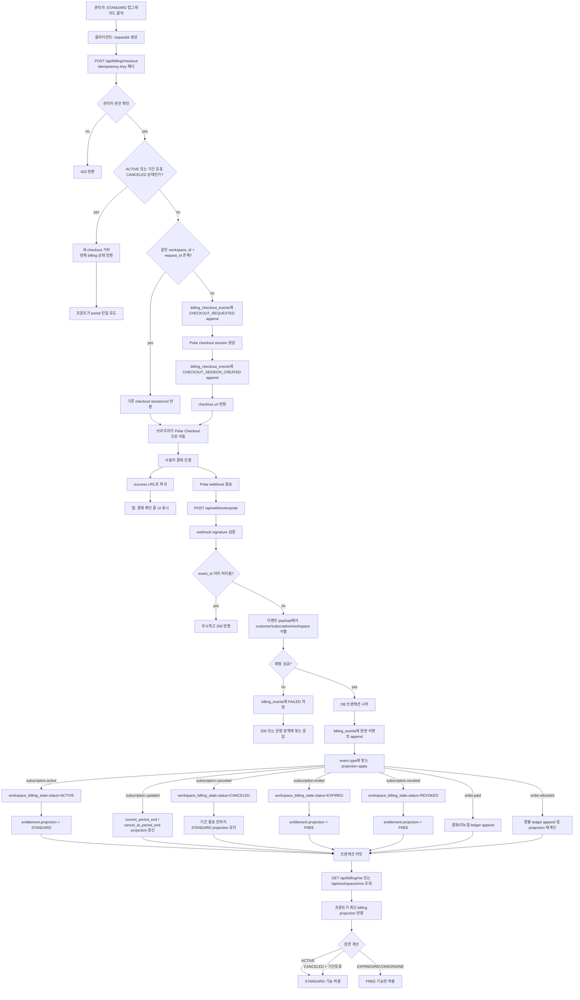
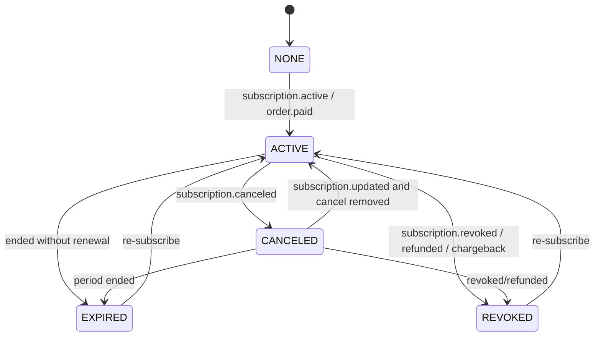

# Polar 결제 MVP 설계안

## 문서 상태

- 이 문서는 Polar billing MVP의 구현 계획 문서다.
- 2026-04-21 기준 billing 관련 DB 스키마 초안은 [`src/db/schema.ts`](/src/db/schema.ts)에 일부 선반영되어 있다.
- 다만 checkout API, portal API, webhook route, projection apply 로직, entitlement 연결은 아직 구현 계획 범위에 남아 있다.
- 따라서 아래 액션 아이템은 `스키마 정의 완료`와 `실제 제품 동작 연결 완료`를 구분해서 읽어야 한다.

### 0.1. 현재 말하는 `외부 연동 없음`의 의미

- 여기서 `외부 연동 없음`은 WIG 서버가 아직 실제 Polar API와 통신하지 않는 상태를 뜻한다.
- 즉 아직 없는 것:
  - 실제 Polar checkout session 생성 호출
  - 실제 Polar customer portal 링크 생성 호출
  - 실제 Polar webhook signature 검증 및 수신 처리
  - 실제 Polar customer/subscription 상태 조회 기반 reconciliation
- 반대로 이미 저장소 안에서 준비된 것:
  - billing용 DB 스키마 초안
  - 플랜 코드(`FREE`, `STANDARD`)와 일부 제품 게이트
  - billing 상태/ledger/projection 설계 문서
- 따라서 현재 단계의 backend skeleton은 `외부 결제사 없이도 내부 계약, 상태 모델, 저장 구조를 먼저 고정하는 작업`으로 이해하면 된다.

### 0.2. 다음 구현 순서 권장안

1. billing 멱등성 규칙을 먼저 확정한다.
   - `billing_checkout_events`의 실제 유니크 제약과 문서의 `(workspace_id, idempotency_key)` 개념을 맞춘다.
   - checkout 요청 멱등성과 webhook event dedupe를 별개 규칙으로 분리한다.
2. API 계약 초안을 먼저 추가한다.
   - `POST /api/billing/checkout`
   - `GET /api/billing/portal`
   - `GET /api/billing/me`
3. backend 구현은 webhook 기준 정합성부터 시작한다.
   - `webhook -> ledger append -> projection apply`
   - checkout보다 entitlement 정확성이 우선이다.
4. entitlement 연결 시점을 정한다.
   - `workspace_billing_state`와 `workspaces.plan_code`를 어떤 규칙으로 함께 반영할지 고정한다.
   - 최소 대상은 `CSV export`, `6개월 히스토리 조회`, 추후 `리더 리마인드`다.
5. 그 다음 UI를 연결한다.
   - profile/settings에 현재 플랜, billing 상태, 업그레이드 버튼, 결제 관리 버튼을 붙인다.

## 1. 배경 및 맥락 (Background & Context)

- WIG는 현재 모든 워크스페이스를 `FREE`로 운영하고 있으며, `planCode` 기반 Free/Standard 경계가 일부 제품 영역에 이미 반영되어 있다.
- 현재 반영된 경계 예시:
  - `FREE` 플랜 히스토리 6개월 제한
  - `STANDARD` 플랜 CSV export 게이트
  - `FREE` 플랜 멤버 수 제한 10명
- 아직 결제/청구 동작은 미구현이며, `STANDARD` 업그레이드는 실제 셀프서브 흐름이 없다.
- 다만 billing용 DB 스키마 초안은 저장소에 선반영되어 있다.
- 결제 공급자 비교 기준 현재 우선 후보는 `Polar`다.
  - 이유:
    - `Merchant of Record` 구조
    - Next.js 친화적 SDK/헬퍼
    - `PG 직접 계약` 부담을 낮추는 방향과 가장 잘 맞음

## 2. 왜 지금 필요한가 (Priority & Rationale)

- `STANDARD` 플랜 개념이 제품과 문서에 이미 등장하므로, 실제 업그레이드 경로가 없으면 제품 신뢰도가 떨어진다.
- 현재 WIG는 복잡한 청구보다 `Free -> Team 업그레이드`, `권한 반영`, `해지/환불 시 회수`가 핵심이다.
- 따라서 1차 결제 도입은 아래를 해결하는 MVP면 충분하다.
  - 워크스페이스 단위 업그레이드
  - 결제 성공 후 `STANDARD` 반영
  - 해지/환불/취소 후 권한 회수
  - 고객이 직접 결제수단과 구독을 관리할 portal 진입

## 3. 목표 (Goals)

### 3.1. MVP 목표

- `FREE -> STANDARD` 업그레이드를 Polar checkout으로 연결한다.
- 결제 상태를 webhook 기준으로 WIG DB에 동기화한다.
- 워크스페이스 단위 플랜 권한을 결제 상태와 일치시킨다.
- 사용자가 제품 안에서 현재 플랜과 billing 상태를 볼 수 있게 한다.
- 사용자가 Polar customer portal로 이동해 결제수단 변경/해지/영수증 확인을 할 수 있게 한다.
- `STANDARD`는 단일 Polar 상품으로 유지하되, 무제한 좌석 상품으로 운영하지 않고 WIG 내부 멤버 상한을 둔다.
- MVP `STANDARD` 가격은 월 29,000원, 멤버 상한은 30명으로 시작한다.
- 플랜별 멤버 상한은 `billing_plan_limits`에서 조회하며, seed 기준은 `FREE=10`, `STANDARD=30`이다.

### 3.2. Post-MVP 목표

- seat 또는 활성 멤버 수 기반 과금
- 큰 팀 대상 custom plan 또는 제한적 상위 상품 티어
- trial
- proration/downgrade 세부 정책
- dunning UI
- 복수 유료 플랜
- 인앱 업그레이드 퍼널/실험

## 4. 범위와 비범위 (Scope / Non-Goals)

### 4.1. MVP 범위

- 단일 유료 플랜: `STANDARD`
- 과금 단위: `workspace` 단위 월 구독
- 멤버 용량: 앱 내부 정책으로 `STANDARD` 멤버 상한을 둠
- 플랜 제한 저장 위치: `billing_plan_limits`
- 가격: 월 29,000원
- 구매 주체: 워크스페이스 관리자
- 공급자: `Polar`
- 상태 반영 방식: checkout 결과를 신뢰하지 않고 webhook을 단일 진실 원천으로 사용
- self-serve portal: Polar customer portal 사용

### 4.2. MVP 비범위

- 연간 결제
- seat 기반 자동 증감 과금
- usage-based billing
- `STANDARD_10`, `STANDARD_20`, `STANDARD_30` 같은 다중 Polar 상품 티어
- 복수 워크스페이스 묶음 청구
- 쿠폰/프로모션
- 인보이스 커스텀 로직
- 수동 세금 처리
- 한국 국내 카드/계좌 결제 동시 제공

## 5. 제품 원칙 (Product Principles)

- 결제는 `STANDARD` 가치의 입구일 뿐이고, 핵심 메시지는 여전히 `리더가 팀을 더 잘 움직이게 해준다`여야 한다.
- 권한은 checkout redirect가 아니라 webhook 처리 기준으로만 열린다.
- 해지/환불/차지백은 제품 권한에 즉시 또는 명시된 시점에 반영되어야 한다.
- 사용자가 billing 상태를 이해하지 못해 support ticket이 생기지 않도록 제품 내 문구를 명확히 둔다.
- `FREE는 본다 / STANDARD는 움직인다` 문구 원칙을 유지한다.
- Polar는 billing infrastructure와 portal을 제공하지만, 최종 entitlement 판단은 WIG 서버가 직접 가진다.

## 5.1. 아키텍처 원칙

- 과금 단위는 `user`가 아니라 `workspace`다.
- 구매 주체와 권한 귀속 대상을 분리한다.
  - 구매 주체: 현재 결제를 실행하는 워크스페이스 관리자
  - 권한 귀속 대상: 워크스페이스 전체
- billing 원장은 append-only로 유지한다.
  - provider webhook, checkout 시도, 운영 보정은 모두 `새 이벤트 append`로 기록한다.
  - 기존 billing row를 직접 덮어써서 이력을 잃는 방식은 허용하지 않는다.
- 현재 billing 상태는 원장이 아니라 projection으로 읽는다.
  - entitlement, UI 노출, 운영 조회는 ledger를 재생성 가능한 read model 기준으로 처리한다.
- billing 상태는 매 요청마다 Polar API를 실시간 조회해 판단하지 않는다.
  - webhook로 append된 WIG billing ledger를 1차 진실 원천으로 사용한다.
  - projection은 조회 최적화를 위한 파생 상태로만 사용한다.
  - 필요할 때만 운영/복구 목적의 provider 조회를 수행한다.
- checkout success redirect는 UX 보조 신호일 뿐이고, 권한 변경 트리거로 신뢰하지 않는다.
- 첫 MVP에서는 billing 복잡도를 억제하고, seat/usage/proration/trial/coupon은 Post-MVP로 둔다.

## 6. 결제 모델 결정 (Billing Model Decisions)

### 6.1. 플랜 구조

- `FREE`
  - 기본 플랜
- `STANDARD`
  - 단일 유료 플랜
  - 단일 Polar 상품으로 운영
  - 월 29,000원
  - 내부 멤버 상한 30명을 두고, 상한 초과 시 신규 초대/참가를 차단한다.

### 6.2. 과금 단위

- 1차는 `workspace 월 정액`으로 고정한다.
- 이유:
  - 현재 WIG의 플랜 게이트가 워크스페이스 단위다.
  - WIG의 경제적 가치도 개인 생산성보다 팀 운영/리더 개입 단위에서 더 강하게 발생한다.
  - 사용자 단위 개인 구독으로 시작하면 추후 workspace entitlement와 충돌할 가능성이 크다.
  - seat/활성 사용자 과금은 member sync, quantity update, proration 논리를 추가로 요구한다.
  - 다중 상품 티어는 seat sync는 피할 수 있지만 상품 ID, checkout 매핑, webhook 검증, 고객지원 문구가 티어 수만큼 늘어난다.
  - 초기 결제 MVP의 목적은 매출 최적화보다 업그레이드 가능성 검증이다.

### 6.3. 권한 종료 시점

- 기본안:
  - `canceled`: 현재 결제 주기 종료 전까지 `STANDARD` 유지
  - `revoked` 또는 환불/차지백 등 즉시 효력 상실 이벤트: 즉시 `FREE`로 회수
- 이유:
  - 일반 해지는 고객 기대와 맞게 grace period를 유지하는 편이 자연스럽다.
  - 강제 취소/환불성 이벤트는 권한을 즉시 닫아야 정합성이 맞다.

### 6.4. 환불 시 권한 회수 정책

- v1 기본 원칙:
  - `전액 환불이 확정되면 즉시 FREE로 회수`한다.
- 이유:
  - 환불은 해당 결제 주기에 대한 사용 권한을 되돌리는 의미에 가깝다.
  - 환불 이후에도 `STANDARD`를 유지하면 사용자 기대, 회계 해석, 권한 정합성이 모두 흔들린다.
  - 차지백/강제 취소와 동일한 그룹으로 보는 편이 운영상 단순하다.
- 예외:
  - Polar 측 운영 사유로 일시 보정이 필요하거나, WIG가 개별 고객 지원 차원에서 기간 유지 보상을 하기로 한 경우는 수동 처리 예외로 둔다.
  - 이 경우에도 자동 정책은 `즉시 FREE 회수`를 유지하고, 예외 보상은 별도 내부 운영 절차로 처리한다.
- 부분 환불:
  - MVP에서는 부분 환불에 따른 부분 권한 유지/기간 연장은 지원하지 않는다.
  - 부분 환불이 발생해도 자동 entitlement는 바꾸지 않고 운영자 수동 판단 대상으로 분리한다.

### 6.4.a. 환불 허용 정책 v1

- 기본 원칙:
  - 월 구독은 언제든 해지할 수 있다.
  - 다만 이미 결제된 기간에 대해서는 원칙적으로 환불하지 않는다.
  - 일반 해지는 `다음 결제일부터 중단`으로 처리하고, 환불과 동일시하지 않는다.
  - `no-refund` 문구를 쓰더라도 Polar가 chargeback 예방 목적으로 구매 후 60일 내 자체 판단 환불을 할 수 있다는 전제를 둔다.
- 예외 환불 허용 조건:
  - 아래를 모두 만족할 때만 예외 환불 가능
    - 결제 후 `48시간 이내`
    - 핵심 유료 기능 사용 `1회 이하`
    - 명백한 오결제 또는 운영상 정당한 예외 사유가 확인됨
- 예외 사유 예시:
  - 중복 결제
  - 결제 직후 기술적 오류로 `STANDARD` 권한이 정상 제공되지 않음
  - 플랜/가격 오인 등 명백한 오결제
- 환불 불가 기본값:
  - 단순 변심
  - 이미 해당 결제 기간 동안 핵심 유료 기능을 실질적으로 사용한 경우
  - 기간 말 해지 대신 즉시 환불을 요청하는 일반 케이스
- 처리 원칙:
  - 예외 환불이 승인되면 즉시 `FREE`로 회수한다.
  - 부분 환불은 기본 미지원이며 수동 운영 대상으로만 다룬다.
  - 실제 결제 운영 시작 시점에는 환불정책, 플랜 화면, 약관 문구를 동일 기준으로 맞춘다.
  - 이 판단에 필요한 유료 기능 사용 여부는 billing 이후 별도 usage event로 남아 있어야 한다.
  - 환불 정책은 `환불 가능 예외`, `일반 해지는 기간 말 종료`, `Polar의 chargeback 예방 환불 가능성`까지 한 세트로 설명해야 한다.

### 6.4.b. 핵심 유료 기능 정의

- 환불 예외 판단에서 말하는 `핵심 유료 기능`은 현재 시점에 실제로 열린 `STANDARD` 전용 기능으로 본다.
- 1차 기준:
  - `CSV export` 사용
  - `리더 리마인드` 또는 동등한 `리더 개입 기능` 사용
- 집계 기준:
  - 환불 판단용 usage는 UI 클릭 수가 아니라 `서버 성공 이벤트` 기준으로 집계한다.
  - `CSV export` 1회:
    - export 파일 생성이 성공적으로 완료된 1건
  - `리더 리마인드` 1회:
    - 실제 발송 처리까지 완료된 reminder 1건
  - 단순 버튼 클릭, 모달 진입, draft 저장, 설정 화면 조회는 사용으로 보지 않는다.
- 제외 항목:
  - 플랜 화면 조회
  - 결제 관리 화면 진입
  - 기본 대시보드 조회
  - 워크스페이스 기본 설정 열람
- 판단 메모:
  - `6개월 초과 히스토리 조회`는 업그레이드 가치 설명에는 포함될 수 있지만, 환불 판단용 핵심 기능으로는 보지 않는다.
  - 이유는 단순 조회가 실제 유료 가치 소비인지 판정하기 애매하기 때문이다.
- 운영 주의:
  - 실제 출시 시점에 아직 열리지 않은 `STANDARD` 기능은 핵심 유료 기능 집계에서 제외한다.
  - 즉, 환불 판단은 문서상 기능 목록이 아니라 `실제 운영 중인 STANDARD 게이트` 기준으로 계산한다.

### 6.4.c. 환불 악용 방지 원칙

- WIG는 `수수료 손실`보다 `chargeback 비율 상승`을 더 큰 리스크로 본다.
  - Polar 문서 기준으로 dispute/chargeback는 건당 비용이 있고, 높은 비율은 payout pause, review, 결제 중지로 이어질 수 있다.
- 따라서 운영 기본값은 `환불을 많이 해주는 것`이 아니라 `분쟁으로 가기 전에 오해를 줄이고, 반복 악용은 빠르게 차단`하는 것이다.
- 초기 MVP에서는 아래를 최소 방어선으로 둔다.
  - 동일 workspace 또는 동일 customer의 `refund` / `revoked` 이력을 누적 저장한다.
  - 짧은 기간 내 `upgrade -> refunded/revoked -> re-upgrade` 반복 패턴을 운영 알림 대상으로 올린다.
  - 반복 환불 이력이 임계치를 넘으면 자동 재구매 허용 대신 수동 검토 상태로 전환한다.
  - 환불 이력이 있는 workspace에는 trial, promo, 예외 환불을 더 보수적으로 적용한다.
- 제품 메시지 원칙:
  - `환불 가능`만 강조하지 않고 `해지는 언제든 가능하지만 일반 환불은 예외적`이라는 구조를 분명히 보여준다.
  - billing 화면에 고객지원 경로와 해지 경로를 숨기지 않는다.
  - 청구명, 플랜명, 결제 설명 문구를 일치시켜 `이 결제가 무엇인지 기억나지 않는다`는 분쟁을 줄인다.
- 비권장 접근:
  - 악용 방지 목적으로 실제 돈이 오가는 반복 테스트 결제를 수행하지 않는다.
  - 초기 단계에서 환불 악용만을 이유로 연간-only, 고액 최소 결제 같은 가격 구조를 먼저 강제하지 않는다.
  - 방어의 본체는 가격이 아니라 `정책 일관성`, `usage event`, `반복 패턴 차단`이다.

### 6.5. 향후 상위 유료 티어 추가 시 downgrade 정책

- 전제:
  - MVP는 `STANDARD` 단일 유료 플랜만 운영하므로 실제 downgrade는 `STANDARD -> FREE`만 존재한다.
  - 다만 이후 `PRO`, `BUSINESS` 같은 상위 티어가 생기면 downgrade 정책이 별도 필요하다.
- v1 선행 원칙:
  - 상위 유료 티어 간 downgrade는 `즉시 강등`이 아니라 `다음 결제 주기부터 적용`을 기본으로 한다.
- 이유:
  - proration, 일할 계산, 환불 차액 처리, 기능 회수 타이밍이 동시에 생기면 1차 billing 복잡도가 크게 올라간다.
  - 현재 WIG는 복수 플랜 청구보다 entitlement 정합성 검증이 우선이다.
  - 따라서 상위 티어 추가 초기에는 `schedule downgrade at period end`가 가장 안전하다.
- 권장 규칙:
  - `higher paid tier -> lower paid tier`
    - 현재 결제 주기 종료 전까지 기존 상위 티어 권한 유지
    - 다음 갱신일부터 하위 티어 권한 적용
  - `higher paid tier -> FREE`
    - 일반 해지와 동일하게 기간 말 종료
  - `refund/revoked`
    - 티어 종류와 무관하게 즉시 `FREE`
- Post-MVP 확장 조건:
  - 아래가 필요해지기 전까지는 즉시 downgrade/proration을 열지 않는다.
    - 복수 플랜 가격 정책 고정
    - 차액 환불 규칙 확정
    - entitlement 차이 명확화
    - 고객지원 대응 문구 확정

## 7. 사용자 흐름 (User Flow)

### 7.1. 업그레이드

1. 관리자가 프로필/설정/제한 도달 CTA에서 `STANDARD 업그레이드` 클릭
2. 서버가 Polar checkout session을 생성한다
3. 사용자 브라우저를 Polar checkout으로 리다이렉트한다
4. 결제 완료 후 success URL로 복귀한다
5. UI는 즉시 성공 확정하지 않고 `결제 확인 중` 상태를 노출한다
6. Polar webhook 수신 후 DB 상태를 갱신한다
7. 다음 조회에서 워크스페이스가 `STANDARD`로 보이고 제한이 해제된다

추가 규칙:

- 아래 상태에서는 새 checkout을 생성하지 않는다.
  - `ACTIVE`
  - `CANCELED` 이면서 `currentPeriodEnd > now`
- 위 경우 `POST /api/billing/checkout`은 새 session 생성 대신 현재 billing 상태를 반환하고, 프론트는 `결제 관리` 또는 customer portal 진입으로 유도한다.
- 새 checkout 허용 상태는 아래로 한정한다.
  - `NONE`
  - `EXPIRED`
  - `REVOKED`

### 7.2. 해지

1. 관리자가 앱 내 `결제 관리` 버튼으로 customer portal 진입
2. Polar portal에서 해지 예약 또는 결제수단 변경
3. 관련 webhook 수신
4. WIG가 `cancelAtPeriodEnd` 또는 동등 상태를 저장
5. 종료일까지 `STANDARD` 유지
6. 종료 시점에는 `subscription.updated` 또는 동등한 상태 변경 webhook, 또는 정기 reconciliation job으로 최종 만료를 확정한다
7. 최종 만료가 확인되면 `FREE`로 회수한다
8. 회수 후 멤버 수가 FREE 한도 10명을 초과하면 기존 멤버와 데이터는 유지하되, 워크스페이스 운영 쓰기는 잠그고 멤버 정리 또는 재구독만 허용한다

### 7.3. 환불/차지백/강제 취소

1. Polar에서 refund 또는 revocation 발생
2. webhook 수신
3. WIG는 즉시 `FREE`로 회수
4. 관리자 화면에 `현재 구독이 비활성화되었어요` 상태를 노출
5. 멤버 수가 FREE 한도 10명을 초과하면 기존 멤버와 데이터는 유지하되, 워크스페이스 운영 쓰기는 잠그고 멤버 정리 또는 재구독만 허용한다

### 7.4. 전체 흐름 다이어그램

## 8. 상태 모델 (State Model)

### 8.1. 제품 플랜 상태

- `planCode`
  - `FREE`
  - `STANDARD`

### 8.2. billing 상태

MVP에서는 내부 상태를 아래 수준으로 단순화한다.

- `NONE`
  - 아직 결제 기록 없음
- `ACTIVE`
  - 유효한 유료 구독
- `CANCELED`
  - 해지 예약 또는 취소 상태지만 현재 기간 내 권한 유지 가능
- `EXPIRED`
  - 결제 종료가 확정되어 더 이상 권한이 없는 종료 상태
- `REVOKED`
  - 환불/차지백/강제 취소 등으로 권한 즉시 제거

### 8.3. 권한 계산 규칙

- `ACTIVE` => `STANDARD`
- `CANCELED` + `currentPeriodEnd > now` => `STANDARD`
- `EXPIRED` => `FREE`
- `REVOKED` => `FREE`
- `NONE` => `FREE`

### 8.4. 상태 전이 다이어그램

## 9. 데이터 모델 (Data Model)

## 9.1. 저장 위치

- MVP는 `workspaces` 직접 상태 갱신 중심이 아니라 `billing ledger + projection` 구조로 시작한다.
- 저장 계층은 아래 3개로 나눈다.
  - append-only 원장: provider/webhook/운영 이벤트
  - append-only request log: checkout 요청/재시도/실패 이력
  - read model projection: 현재 상태와 entitlement 조회용 요약

### 9.2. append-only 원장 테이블 초안

예시: `billing_events`

| 컬럼                | 설명                                                |
| ------------------- | --------------------------------------------------- |
| `id`                | PK                                                  |
| `provider`          | `POLAR`                                             |
| `event_type`        | 내부 표준 이벤트명 또는 provider 이벤트명           |
| `provider_event_id` | provider event id, 없으면 nullable                  |
| `workspace_id`      | 매핑된 워크스페이스                                 |
| `subscription_key`  | provider subscription 식별자 또는 내부 구독 묶음 키 |
| `occurred_at`       | provider 기준 발생 시각                             |
| `recorded_at`       | WIG가 append한 시각                                 |
| `payload_json`      | 원본 payload                                        |
| `status`            | `ACCEPTED` / `IGNORED` / `FAILED`                   |
| `failure_reason`    | 실패 사유 메모, nullable                            |
| `source`            | `WEBHOOK` / `RECONCILIATION` / `MANUAL_CORRECTION`  |

원칙:

- 이 테이블은 append-only다.
- 중복 webhook도 덮어쓰지 않고 `IGNORED` 이벤트로 남길 수 있다.
- projection 재생성은 이 테이블만으로 가능해야 한다.

### 9.2.1. checkout 요청 append-only 로그 초안

예시: `billing_checkout_events`

| 컬럼                   | 설명                                   |
| ---------------------- | -------------------------------------- |
| `id`                   | PK                                     |
| `workspace_id`         | checkout을 시도한 워크스페이스         |
| `requested_by_user_id` | 요청 관리자 사용자                     |
| `request_id`           | 클라이언트 또는 서버가 생성한 멱등 키  |
| `target_plan_code`     | 예: `STANDARD`                         |
| `provider`             | `POLAR`                                |
| `provider_checkout_id` | provider checkout/session 식별자       |
| `event_type`           | checkout 관련 내부 이벤트명            |
| `occurred_at`          | 이벤트 발생 시각                       |
| `recorded_at`          | WIG가 append한 시각                    |
| `payload_json`         | provider 응답 또는 내부 메타, nullable |

원칙:

- 이 테이블도 append-only로 유지한다.
- 같은 요청의 재처리나 상태 변화도 기존 row를 수정하지 않고 후속 이벤트 append로 표현한다.
- checkout 현재 상태가 필요하면 projection 또는 request_id 기준 최신 이벤트 조회로 계산한다.
- 현재 스키마 유니크 인덱스는 `(request_id, event_type, recorded_at)`로 들어가 있으므로, 최종 멱등성 보장은 구현 배치에서 다시 맞춰야 한다.

예시 이벤트:

- `CHECKOUT_REQUESTED`
- `CHECKOUT_SESSION_CREATED`
- `CHECKOUT_SESSION_REUSED`
- `CHECKOUT_REDIRECTED`
- `CHECKOUT_EXPIRED`
- `CHECKOUT_FAILED`

### 9.2.2. 현재 상태 projection 초안

예시: `workspace_billing_state`

- 목적:
  - 현재 billing 상태 조회
  - entitlement 계산 단순화
  - 프로필/게이트/UI 응답 최적화
- 포함 필드 예시:
  - `workspace_id`
  - `provider`
  - `status`
  - `plan_code`
  - `customer_id`
  - `subscription_id`
  - `current_period_end`
  - `cancel_at_period_end`
  - `billing_owner_user_id`
  - `last_event_id`
  - `last_event_occurred_at`

원칙:

- 이 테이블은 진실 원천이 아니다.
- 언제든 `billing_events` replay로 재생성 가능해야 한다.
- 기존 코드 호환을 위해 `workspaces.plan_code`를 유지하더라도, 그 값은 projection apply 결과를 반영한 cache로만 취급한다.

### 9.3. `workspaces`에 추가할 필드 최소화

- 원칙적으로 billing 정합성 판단용 필드는 `workspaces`에 직접 넣지 않는다.
- 다만 아래 둘은 넣을 수 있다.
  - `billing_customer_external_ref`
    - 예: `workspace:{workspaceId}`
    - 목적:
      - Polar customer 또는 checkout metadata와 WIG 워크스페이스를 안정적으로 매핑
  - `billing_owner_user_id`
    - nullable
    - 현재 billing 관리 책임자 기록
    - ownership audit 및 고객지원 문맥 기록에 사용

- 그 외 `billing_status`, `billing_current_period_end`, `billing_subscription_id` 같은 현재 상태 필드는 projection으로 옮기는 편이 맞다.

### 9.4. customer/workspace 매핑 전략

- checkout 생성 시 workspace id를 metadata로 넣고, customer external id도 함께 일관되게 구성한다.
- 추천값:
  - customer external id: `workspace:{workspaceId}`
  - metadata: `workspaceId`, `workspaceName`, `adminUserId`
- webhook에서 이 식별자를 사용해 WIG 워크스페이스와 매핑한다.
- 구매 주체가 워크스페이스 관리자이더라도 권한은 `사용자`가 아니라 `workspace`에 귀속된다.
- 사용자 교체가 생겨도 `workspace` 식별자는 유지되므로, billing ownership 이전과 entitlement 유지가 단순해진다.

## 10. API / 서버 설계 (API & Server Design)

### 10.1. 신규 서버 책임

- Polar checkout session 생성
- Polar customer portal 링크 생성 또는 route 연결
- webhook 수신, 검증, ledger append
- billing projection 갱신
- workspace billing 상태 조회
- entitlement 계산 공통화

### 10.2. 제안 엔드포인트

- `POST /api/billing/checkout`
  - 현재 관리자 세션의 워크스페이스를 `STANDARD` checkout으로 보냄
  - `Idempotency-Key` 헤더를 받아 멱등하게 처리
- `GET /api/billing/portal`
  - 현재 워크스페이스의 ADMIN이면 누구나 billing customer 기준 portal로 리다이렉트 가능
- `GET /api/billing/me`
  - 현재 워크스페이스 기준 플랜/상태/갱신일/관리 가능 여부 조회
- `POST /api/webhooks/polar`
  - Polar webhook endpoint
- `GET /api/workspaces/me`
  - 기존 응답에 billing 요약 필드 추가 검토

### 10.3. OpenAPI 반영 원칙

- 실제 public contract로 노출할 API만 `src/api-spec/openapi.yaml`에 반영한다.
- webhook route는 내부용이라도 저장소 규칙상 제품 API 계약 범위에 들어가면 명시 여부를 판단해야 한다.
- 최소한 사용자-facing billing 조회 응답은 OpenAPI에 포함하는 편이 맞다.
- `POST /api/billing/checkout`에는 본문 필드 대신 `Idempotency-Key` 헤더를 명시한다.
- 현재 OpenAPI에는 `Workspace.planCode`까지만 반영되어 있고, billing 전용 contract는 아직 없다.

## 11. Polar 연동 설계 (Polar Integration)

### 11.1. 사용할 기능

- Checkout
- Customer Portal
- Webhooks

### 11.2. checkout metadata

최소 포함:

- `workspaceId`
- `workspaceName`
- `adminUserId`
- `customerExternalId`

원칙:

- webhook만으로 workspace 매핑이 가능해야 한다.
- checkout success redirect의 쿼리 파라미터만 신뢰하지 않는다.
- 동일 workspace에서 재시도 checkout이 발생해도 같은 customer identity로 수렴해야 한다.

### 11.2.1. checkout 멱등성 원칙

- `POST /api/billing/checkout`은 멱등 API로 취급한다.
- 클라이언트는 업그레이드 버튼을 누를 때 `Idempotency-Key` 헤더 값을 생성해 함께 전송한다.
- 서버는 `(workspace_id, idempotency_key)` 유니크 키로 요청을 저장한다.
- 같은 `Idempotency-Key`로 재요청이 오면 새 Polar checkout session을 만들지 않고 기존 결과를 반환한다.
- 같은 workspace에 아직 유효한 `CREATED` checkout이 있으면, `Idempotency-Key`가 달라도 기본적으로 기존 checkout을 우선 재사용한다.
- request 단위 멱등성의 목적은 `중복 checkout session 생성 방지`이지 `중복 결제 완전 방지` 자체는 아니다.
  - 실제 유료 권한 반영은 여전히 webhook event 기준으로만 처리한다.
- `Idempotency-Key` 값은 UUID 등 충돌 가능성이 낮은 값으로 충분하며, 결제 성공 여부를 판정하는 비밀 토큰으로 사용하지 않는다.

### 11.3. 처리 대상 webhook

- `subscription.active`
  - `STANDARD` 활성화
- `subscription.canceled`
  - 해지 예약 상태 저장
- `subscription.revoked`
  - 즉시 `FREE` 회수
- `subscription.updated`
  - 최신 기간 종료일/취소 상태 동기화
- `subscription.ended` 또는 동등한 종료 상태 이벤트
  - 기간 종료 후 `EXPIRED` 전환
- `order.paid`
  - 최초 유료 전환 확인 또는 리뉴얼 로그 기록
- `order.refunded`
  - 환불성 이벤트 기록 및 필요 시 즉시 회수

### 11.4. webhook 처리 원칙

- raw payload 검증 필수
- idempotent 처리 필수
- 이미 처리한 event도 필요하면 `IGNORED` 기록으로 append 가능
- provider payload 누락/매핑 실패 시 `FAILED`로 적재하고 alarm 대상에 포함
- webhook 반영은 DB 트랜잭션 안에서 `ledger append`와 `projection apply`를 함께 커밋한다.

정리:

- checkout 요청 멱등성 => `Idempotency-Key`
- webhook 반영 멱등성 => provider `event_id`

둘은 역할이 다르므로 둘 다 필요하다.

### 11.5. customer state 사용 원칙

- Polar의 customer/subscription state는 동기화 기준 정보로 활용한다.
- 다만 실시간 entitlement 판정은 webhook로 append된 ledger에서 계산된 WIG projection을 우선 사용한다.
- 운영 중 정합성 의심이 생기면 아래 순서로 복구한다.
  1. 저장된 provider id로 Polar customer/subscription 상태 조회
  2. 누락/불일치 이벤트를 `RECONCILIATION_CORRECTED` 성격의 내부 이벤트로 append
  3. projection을 재적용하거나 전체 replay 수행

### 11.6. 종료 시점 reconciliation 원칙

- 일반 해지의 가장 큰 실패 모드는 `cancel_at_period_end`까지만 저장되고 실제 만료 시점에 권한 회수가 누락되는 경우다.
- 따라서 MVP라도 아래 둘 중 하나는 반드시 필요하다.
  - provider 종료 webhook을 명시적으로 처리
  - 하루 1회 이상 `workspace_billing_state.current_period_end < now`인 `CANCELED` projection을 재검산하는 reconciliation job
- 권장안:
  - webhook 우선
  - reconciliation job을 안전망으로 추가

## 12. UI 설계 (UI & Messaging)

### 12.1. 진입점

- 프로필 메인
- 멤버 관리 화면의 제한 도달 구역
- CSV export 잠금 구역
- 업데이트 허브 또는 pricing 섹션

### 12.2. MVP UI 요소

- 현재 플랜 배지
- billing 상태
- 다음 갱신일 또는 종료 예정일
- `STANDARD 업그레이드` 버튼
- `결제 관리` 버튼

### 12.3. 상태별 카피 방향

- `FREE`
  - `현재 FREE 플랜을 사용 중이에요`
- `STANDARD`
  - `현재 STANDARD 플랜을 사용 중이에요`
- `CANCELED`
  - `해지가 예약되어 있어요. {date}까지 STANDARD 기능을 사용할 수 있어요`
- `EXPIRED`
  - `구독 기간이 종료되어 현재 FREE 플랜을 사용 중이에요`
- `REVOKED`
  - `환불 또는 결제 취소로 인해 FREE 플랜으로 전환되었어요`
- `pending confirmation`
  - `결제를 확인하고 있어요. 잠시 후 자동으로 반영돼요`

### 12.4. portal 접근 권한 원칙

- MVP에서는 현재 워크스페이스의 `ADMIN`이면 누구나 `결제 관리` 버튼을 볼 수 있고 portal에 진입할 수 있다.
- 이유:
  - WIG의 권한 구조가 이미 workspace admin 중심으로 작동한다.
  - `billing_owner` 1인 전용 접근으로 시작하면 관리자 교체, 휴가, 탈퇴 시 운영 장애가 생기기 쉽다.
  - 실제 결제 책임자 정보는 `billing_owner_user_id`로 보존하되, portal 접근 authorization과 분리하는 편이 안전하다.

## 13. 권한 게이트 반영 범위 (Entitlement Mapping)

MVP에서 실제로 `STANDARD`와 강하게 연결할 항목:

- CSV export
- 리더 리마인드
- 6개월 초과 히스토리 조회
- 향후 `결제 관리` 화면 표시

주의:

- `STANDARD`를 샀는데도 기존 제한이 잠겨 있으면 체감 장애가 크므로, 최소 3개 핵심 게이트는 이번 배치에서 정합성을 검증해야 한다.

## 14. 운영 / 지원 정책 (Operational Policy)

- support 문의 채널을 제품에 명확히 표시한다.
- 환불 기본 원칙을 플랜 화면/약관에 명시한다.
- 해지 경로는 숨기지 않는다.
- 차지백 예방을 위해 청구명, 상품명, 플랜 설명을 일치시킨다.
- webhook 실패 시 수동 재처리 절차를 정한다.
- 환불 예외 판단에 필요한 `핵심 유료 기능 사용 이벤트` 수집 책임을 명확히 둔다.

### 14.1. chargeback 우선 운영 원칙

- 환불 악용 방지보다 더 우선하는 운영 목표는 `chargeback로 번지지 않게 만드는 것`이다.
- 이유:
  - 카드사 dispute는 직접 비용이 들고, 누적 비율이 높아지면 Polar account review와 payout pause 리스크가 생긴다.
- 따라서 billing 운영 화면과 고객 대응은 아래를 우선 충족해야 한다.
  - 사용자가 현재 플랜, 다음 갱신일, 해지 예약 상태를 스스로 확인할 수 있어야 한다.
  - 해지와 결제 관리 진입점을 숨기지 않아야 한다.
  - support 문의 경로를 billing 화면과 결제 관련 안내 문구에 함께 둬야 한다.
  - 환불 거절 시에도 `왜 안 되는지`, `대신 해지는 어떻게 되는지`를 분리해서 설명해야 한다.

### 14.2. 반복 악용 탐지 기본안

- MVP에서 바로 필요한 운영 신호:
  - workspace별 refund 횟수
  - customer별 refund 횟수
  - 최근 30일 내 `revoked` 또는 `order.refunded` 횟수
  - 최근 30일 내 재구매 횟수
  - 환불 직전 핵심 유료 기능 사용 여부
- 운영 기본 규칙 초안:
  - `refund/revoked`가 최근 30일 내 2회 이상이면 운영 검토 대상으로 표시한다.
  - 최근 30일 내 `upgrade -> refund/revoked -> re-upgrade`가 2회 이상 반복되면 다음 업그레이드는 자동 허용 대신 수동 검토 후보로 본다.
  - 동일 workspace가 이미 예외 환불을 받은 뒤 다시 환불을 요청하면 기본값은 거절이다.
- 주의:
  - 위 임계치는 초기 운영 기준이며, 실제 판매량이 쌓이면 chargeback 비율과 support 처리량을 보고 재조정한다.
  - 자동 차단은 잘못 설계하면 정상 고객을 막을 수 있으므로, 1차는 `운영 알림 + 수동 검토`부터 시작하는 편이 안전하다.

### 14.3. usage event 수집 책임

- 환불 악용 방지와 예외 환불 판단을 위해 아래 이벤트는 서버 성공 기준으로 남겨야 한다.
  - `STANDARD_CSV_EXPORTED`
  - `STANDARD_LEADER_REMINDER_SENT`
  - 이후 추가되는 `STANDARD` 전용 핵심 기능 성공 이벤트
- 목적:
  - 예외 환불 판단 일관성 확보
  - 반복 환불 악용 탐지 시 실제 가치 소비 여부 확인
  - support 응대 시 `결제는 됐지만 실제 사용은 거의 없었는지` 빠르게 판별
- 구현 원칙:
  - UI 클릭이 아니라 서버 성공 이벤트만 집계한다.
  - refund/revoked 이벤트와 같은 timeline에서 조회 가능해야 한다.
  - billing 정책 문서와 실제 이벤트 명세를 함께 맞춘다.

## 15. 보안 및 안정성 포인트 (Security & Reliability)

- webhook secret 검증
- event id dedupe
- ledger append와 projection apply의 원자성 보장
- 관리자만 checkout/portal 진입 가능
- 다른 워크스페이스로의 billing 오연결 방지
- provider id 외부 노출 최소화
- projection replay 가능성 보장

## 16. 검증 기준 (Verification)

### 16.1. 자동 검증

- checkout endpoint 권한 테스트
- checkout 동일 `Idempotency-Key` 재요청 시 기존 session 재사용 테스트
- checkout 다른 `Idempotency-Key`라도 같은 workspace의 미완료 session 재사용 테스트
- portal endpoint 권한 테스트
- ADMIN은 portal 진입 가능, MEMBER는 불가 테스트
- webhook signature 검증 테스트
- webhook idempotency 테스트
- `subscription.active` 수신 시 ledger append + projection `STANDARD` 전환 테스트
- `subscription.canceled` 수신 시 ledger append + grace period projection 유지 테스트
- `workspace_billing_state.current_period_end` 경과 후 `EXPIRED` 전환 테스트
- `subscription.revoked` 수신 시 ledger append + 즉시 `FREE` projection 테스트
- 동일 ledger replay 시 같은 projection이 재현되는 테스트
- CSV export 게이트 해제/재잠금 회귀 테스트

### 16.2. 수동 검증

- Free 워크스페이스에서 업그레이드 버튼 진입
- sandbox checkout 완료 후 플랜 반영
- portal 진입 후 해지 예약
- 기간 종료 후 플랜 회수
- 환불 이벤트 수신 시 권한 회수

### 16.3. 로컬 sandbox 테스트 방법

- 전제:
  - 로컬 앱은 `yarn dev`로 실행 중이어야 한다.
  - Polar 환경은 `sandbox`를 사용한다.
  - 로컬에서 webhook까지 테스트하려면 `localhost`만으로는 부족하고 외부에서 접근 가능한 tunnel URL이 필요하다.
- 이유:
  - 브라우저 redirect는 `localhost`에서도 일부 확인할 수 있지만, Polar webhook은 사용자의 로컬 머신 `localhost`로 직접 들어올 수 없다.
  - 따라서 checkout redirect와 webhook 반영을 함께 보려면 `ngrok` 또는 `cloudflared tunnel` 같은 공개 URL이 필요하다.

#### 16.3.1. 권장 테스트 URL 구조

- webhook URL:
  - `https://<public-tunnel-domain>/api/webhooks/polar`
- success URL:
  - `https://<public-tunnel-domain>/billing/success`
- return 또는 cancel URL:
  - `https://<public-tunnel-domain>/billing`

원칙:

- webhook URL은 반드시 서버 API route여야 한다.
- success URL은 결제 성공 확정 화면이 아니라 `결제 확인 중` 상태를 보여주고 서버 상태를 다시 조회하는 용도로 쓴다.
- return/cancel URL은 사용자가 checkout을 빠져나왔을 때 복귀할 billing 화면으로 둔다.

#### 16.3.2. `ngrok` 기준 로컬 테스트 순서

1. 로컬 앱 실행
   - `yarn dev`
2. 공개 tunnel 실행
   - 예: `ngrok http 4000`
3. 앱 기준 base URL을 tunnel 주소로 맞춘다
   - 예: `APP_BASE_URL=https://<ngrok-domain>`
4. Polar sandbox 설정에 아래 값을 입력한다
   - Webhook URL: `https://<ngrok-domain>/api/webhooks/polar`
   - Success URL: `https://<ngrok-domain>/billing/success`
   - Return/Cancel URL: `https://<ngrok-domain>/billing`
5. 앱에서 upgrade 버튼을 눌러 sandbox checkout을 진행한다
6. checkout 완료 후 success URL 복귀를 확인한다
7. Polar webhook delivery와 WIG ledger/projection 반영을 함께 확인한다

#### 16.3.3. sandbox 결제 입력값 예시

- Polar sandbox checkout에서는 실제 카드가 아니라 테스트 카드 번호로 검증한다.
- 가장 자주 쓰는 테스트 입력 예시는 아래와 같다.
  - Visa 성공: `4242 4242 4242 4242`
  - Visa 실패(거절): `4000 0000 0000 0341`
  - ✅ Mastercard 성공: `5555 5555 5555 4444`
  - Mastercard 3D Secure: `5200 0000 0000 0007`
- CVC는 임의의 3~4자리 숫자를 넣는다.
  - 예: `123`, `1234`
- 만료일은 반드시 미래 날짜를 사용한다.
  - 예: `12 / 2030`
- checkout이 일반 카드 입력으로 실패하면 실제 결제카드 대신 위 sandbox 테스트 카드로 다시 시도해야 한다.
- 3D Secure 흐름까지 확인하려면 `5200 0000 0000 0007`로 별도 검증한다.
- 참고: https://docs.stripe.com/testing

#### 16.3.4. 확인 포인트

- checkout redirect 자체가 정상 동작하는지
- success URL 복귀 후 UI가 즉시 성공 확정하지 않고 `결제 확인 중` 상태를 보여주는지
- webhook이 `POST /api/webhooks/polar`로 실제 도달하는지
- webhook 처리 후 `billing_events` append와 `workspace_billing_state` projection 갱신이 일어나는지
- 최종적으로 `workspaces.plan_code` 또는 동등 entitlement cache가 `STANDARD`로 반영되는지
- 기존 게이트인 `CSV export`, `6개월 초과 히스토리 조회`가 즉시 열리는지

#### 16.3.5. 운영 주의사항

- tunnel URL은 재시작 시 바뀔 수 있으므로 바뀌면 Polar sandbox 설정도 다시 갱신해야 한다.
- `POLAR_CHECKOUT_TOKEN`은 서버 전용이며 프론트엔드 번들 또는 `NEXT_PUBLIC_*`로 노출하면 안 된다.
- pre-authenticated customer portal 링크를 만들려면 `customer_sessions:write` scope가 있는 `POLAR_ACCESS_TOKEN`이 필요하다.
  - `POLAR_CHECKOUT_TOKEN`만으로 checkout은 되더라도 portal session 생성은 `insufficient_scope`로 실패할 수 있다.
- webhook 검증에는 별도 `POLAR_WEBHOOK_SECRET`을 사용한다.
- Polar product ID는 환경 변수로 두지 않고 `billing_provider_products`에서 `provider + environment + plan_code` 기준으로 조회한다.
- 실제 운영 도메인이 준비되기 전까지는 sandbox webhook 테스트 기준 URL과 production URL을 혼동하지 않도록 분리 관리한다.

## 17. 구현 순서 (Recommended Sequence)

1. ledger / projection 데이터 모델 확정
2. Polar 제품/환경 변수/토큰 설정
3. checkout endpoint 구현
4. webhook endpoint + ledger append + dedupe 구현
5. billing projection 반영
6. profile/settings UI에 플랜 상태 노출
7. portal 진입점 추가
8. 핵심 게이트 회귀 검증

## 17.1. 지금 하지 않을 것

- seat 수량 자동 동기화
- MAU/활성 멤버 기반 usage billing
- 연간 결제
- trial
- coupon/promo code
- dunning 전용 인앱 UX
- 다중 유료 플랜
- 워크스페이스 묶음 청구

## 18. 액션 아이템 (Action Items)

### 백엔드

- [x] append-only `billing_events` ledger 스키마 초안 선반영
- [x] `workspace_billing_state` projection 스키마 초안 선반영
- [x] append-only `billing_checkout_events` 스키마 초안 선반영
- [x] `workspaces`에는 어떤 billing 식별자만 남길지 최소화하는 방향의 스키마 초안 선반영
- [ ] 스키마 초안과 실제 checkout/webhook 멱등성 제약을 다시 맞추기
- [ ] `STANDARD` 멤버 상한 정책을 `FREE` 한도 정책과 함께 공통화
- [ ] Polar checkout route 설계
- [ ] Polar webhook route 설계
- [ ] webhook idempotency 전략 확정
- [ ] checkout request idempotency 전략 확정
- [ ] period-end reconciliation job 도입 여부 확정
- [ ] ledger -> projection apply 로직 공통화
- [ ] projection replay 전략 확정

### 프론트엔드

- [ ] profile/settings에 billing 섹션 추가
- [ ] 업그레이드 CTA 위치 확정
- [ ] 결제 확인 중 상태 UI 추가
- [ ] portal 진입 버튼 추가
- [ ] canceled/revoked 상태 문구 확정

### 문서 / 정책

- [ ] 환불/해지 정책을 플랜 화면, FAQ, 약관 문구로 제품 반영
- [ ] 고객지원 경로 표시 위치 확정
- [ ] 청구명/플랜명/상품명 일치 원칙 확정
- [ ] 환불 판단용 핵심 유료 기능 usage event 정의
- [ ] refund/revoked 반복 패턴에 대한 운영 알림 기준 정의
- [ ] 반복 환불 이력 workspace의 재구매 차단 또는 수동 검토 규칙 확정
- [x] `docs/dev/common/2026.03.09-database-schema.md`에 billing 스키마 현재 상태 반영
- [ ] 필요 시 `docs/onboarding.md`에 유료 플랜 도입 상태 갱신

## 19. 확정 사항과 오픈 질문 (Decisions / Open Questions)

- 확정: `STANDARD`는 월 29,000원으로 시작한다.
- 확정: `STANDARD` 내부 멤버 상한은 30명으로 시작한다.
- checkout 성공 직후 UI polling을 둘 것인가, 단순 새로고침 유도만 둘 것인가
- Free 제한 중 어떤 항목을 업그레이드 CTA의 주 메시지로 세울 것인가

## 20. 현재 판단 요약 (Current Recommendation)

- 첫 결제 MVP는 `Polar + workspace 월 정액 + append-only billing ledger + projection 기반 entitlement` 조합으로 가는 것이 가장 현실적이다.
- 이 설계의 핵심 성공 조건은 checkout 자체가 아니라 `상태 정합성`이다.
- 따라서 구현 우선순위는 `checkout 예쁘게 만들기`보다 아래 3개에 둬야 한다.
  - `append-only ledger 정착`
  - `projection 재현 가능성`
  - `STANDARD <-> FREE 권한 전환 정확성`

## 21. 참고 자료 (References)

- Polar Merchant of Record: https://docs.polar.sh/merchant-of-record/introduction
- Polar Fees: https://docs.polar.sh/merchant-of-record/fees
- Polar Next.js adapter: https://docs.polar.sh/integrate/sdk/adapters/nextjs
- Polar Customer Portal: https://docs.polar.sh/features/customer-portal
- Polar Payouts: https://docs.polar.sh/features/finance/payouts
- 기존 수익화 전략: `docs/planning/2026.03.18-monetization-strategy.md`
- Free 플랜 정책: `docs/planning/2026.04.14-free-plan-initial-limits-plan.md`
