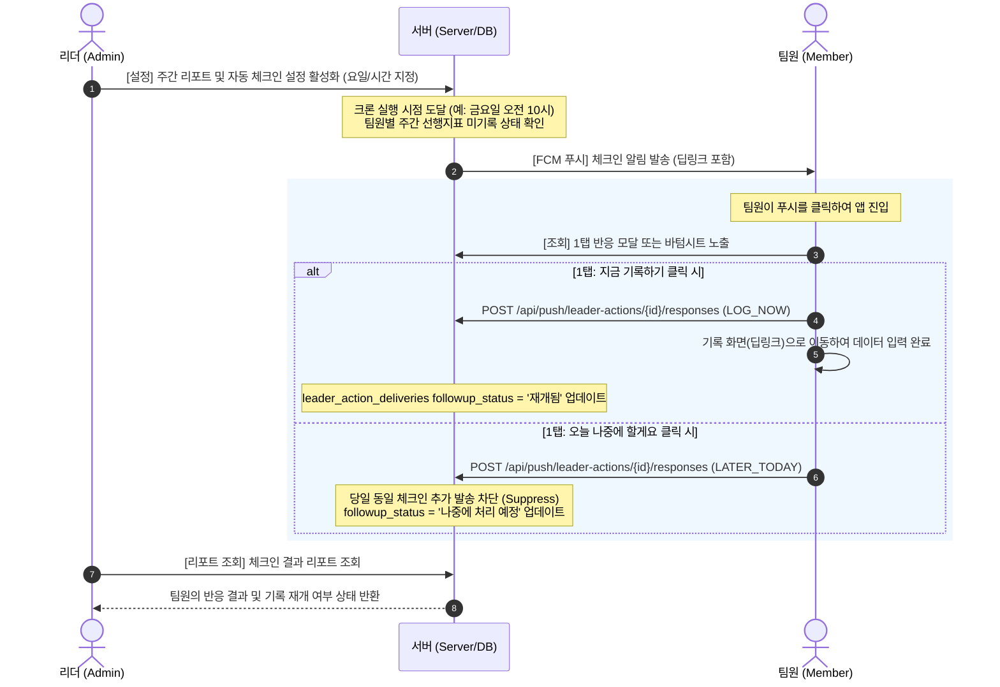

# 리더 리포트 & 자동 운영 체크인 상세 User Flow (v2)

본 문서는 리더와 팀원이 경험하게 될 모든 접점과 화면 와이어프레임, API 요청 및 예외 처리 흐름을 극도로 구체화하여 즉시 개발 및 구현이 가능하도록 정의합니다.

## 1. 핵심 정책 요약 (FCM 기반 전환 반영)

1. **대상**: 이 기능은 **STANDARD** 플랜 전용으로 동작합니다. (FREE는 팀 요약 조회만 제공)
2. **트리거 시점**: 리더가 설정한 특정 요일/시간에 서버 크론이 실행되어 조건을 충족하는 팀원에게만 FCM 푸시 알림을 발송합니다.
3. **알림 환경**: 오직 네이티브 앱(WebView)을 사용하며, FCM 기기 토큰이 등록된 사용자에게만 알림이 전송됩니다.
4. **리더 결과 보고**: 시스템이 보낸 체크인 결과와 팀원의 응답, 후속 기록 상태가 리더 리포트에 실시간으로 업데이트됩니다.

## 2. 전체 User Flow 다이어그램



## 3. 화면별 상세 와이어프레임 & 유저 액션 (Wireframes)

### [화면 1] 리더의 워크스페이스 알림 및 체크인 설정

- **위치**: `설정 > 알림 관리 (또는 워크스페이스 관리)`
- **권한**: 워크스페이스 **ADMIN**만 접근 가능

```text
===================================================================
[←] 알림 및 팀 운영 체크인 설정 (STANDARD 전용)
===================================================================

[ ] 팀 주간 운영 리포트 수신 (FREE/STANDARD 공통)
    - 리더에게 팀의 전반적인 실행 요약을 푸시로 보내줍니다.
    * 발송 요일 선택: [ 매주 월요일 ▼ ]
    * 발송 시간 선택: [ 오전 09:00 ▼ ]

-------------------------------------------------------------------

[v] 자동 운영 체크인 활성화 (STANDARD 전용)
    - 시스템이 실행이 멈춘 팀원에게 직접 상냥하게 알림을 보냅니다.
    * 발송 요일 선택: [ 매주 금요일 ▼ ]
    * 발송 시간 선택: [ 오전 10:00 ▼ ]

    * 발송 트리거 조건:
      - 선행지표가 있지만 이번 주 기록이 없는 경우
      - 현재 활성 점수판이 없는 경우

[ 저장하기 ]
===================================================================
```

---

### [화면 2] 팀원 모바일 FCM 푸시 수신 화면

- **발송자**: DOWIN 시스템
- **수신 대상**: 이번 주 선행지표 실행을 아직 시작하지 않은 팀원
- **푸시 메시지 내용**:
  - **제목**: `이번 주 선행지표 확인 💡`
  - **본문**: `민수님, {선행지표명} 기록이 아직 없네요. 이번 주를 멋지게 마무리하기 위해 지금 가볍게 기록해볼까요?`
  - **딥링크 URL**: `/dashboard/check-in?actionId=12345` (FCM Data Payload에 포함)

---

### [화면 3] 팀원 1탭 반응 모달 화면 (In-App)

- **위치**: 푸시 알림을 누르고 앱에 진입했을 때 화면 중앙에 모달 또는 하단 바텀시트로 즉시 노출됩니다.
- **화면 구성**:

```text
===================================================================
                  💡 이번 주 실행 체크인
===================================================================
  민수님, {선행지표명} 선행지표에 대한 이번 주 기록이
  아직 비어 있습니다. 작은 실행부터 시작해 볼까요?

  [ 📝 지금 바로 기록하기 ]  ---> 클릭 시: /scoreboard/123/log?date=2026-05-02 로 딥링크

  [ ⏰ 오늘 나중에 할게요 ]  ---> 클릭 시: "알겠습니다. 오늘은 추가 알림을
                                보내지 않을게요!" 토스트 메시지 노출 후 모달 닫힘
===================================================================
```

### [화면 4] 리더의 체크인 결과 리포트 화면

- **위치**: `리포트 > 주간 운영 리포트 > 이번 주 자동 체크인 결과`
- **화면 구성**:

```text
===================================================================
[←] 2026년 5월 1주차 자동 체크인 결과
===================================================================
총 발송 건수: 2건 | 반응 완료: 1건 | 실행 회복됨: 1건

■ 자동 체크인 대상자 목록
-------------------------------------------------------------------
1. 김민수 (팀원)
   - 발송 이유: 주간 선행지표 실행 지연 (금요일 오전 미기록)
   - 마지막 반응: 지금 기록하기 (5/2 10:15)
   - 후속 변화: [ 실행 재개됨 ] ✅

2. 박지현 (팀원)
   - 발송 이유: 활성 점수판 없음
   - 마지막 반응: 무응답
   - 후속 변화: [ 여전히 멈춤 ] ⚠️
-------------------------------------------------------------------

[ 팀 대시보드 전체 보기 ]
===================================================================
```

---

## 4. 백엔드 데이터 모델 & API 명세

### 4.1. 테이블 스키마 변경 사항 (D1)

#### `leader_action_deliveries` (자동 체크인 발송 이력)

| 컬럼명              | 타입    | 제약 조건       | 설명                                                  |
| :------------------ | :------ | :-------------- | :---------------------------------------------------- |
| **id**              | TEXT    | PRIMARY KEY     | 고유 ID                                               |
| **workspace_id**    | TEXT    | NOT NULL, INDEX | 워크스페이스 ID                                       |
| **target_user_id**  | TEXT    | NOT NULL, INDEX | 수신자 ID                                             |
| **scoreboard_id**   | TEXT    | NULLABLE        | 해당 점수판 ID                                        |
| **lead_measure_id** | TEXT    | NULLABLE        | 해당 선행지표 ID                                      |
| **action_type**     | TEXT    | NOT NULL        | `CHECK_IN` (고정)                                     |
| **reason_code**     | TEXT    | NOT NULL        | `WEEKLY_NOT_STARTED`, `NO_SCOREBOARD`                 |
| **delivery_status** | TEXT    | NOT NULL        | `SENT`, `FAILED`                                      |
| **followup_status** | TEXT    | NOT NULL        | `대기중`, `나중에 처리 예정`, `재개됨`, `여전히 멈춤` |
| **created_at**      | INTEGER | NOT NULL        | 생성 시각 (UNIX timestamp)                            |
| **updated_at**      | INTEGER | NOT NULL        | 수정 시각 (UNIX timestamp)                            |

### 4.2. API 엔드포인트 명세

#### 1. 팀원 반응 등록 API

`POST /api/push/leader-actions/{id}/responses`

- **Request Headers**:
  - `Authorization: Bearer <token>`
- **Request URL Parameters**:
  - `id`: `leader_action_deliveries` 테이블의 `id`
- **Request Body**:
  ```json
  {
    "responseType": "LOG_NOW" | "LATER_TODAY"
  }
  ```
- **Response (200 OK)**:
  ```json
  {
    "success": true,
    "nextActionUrl": "/scoreboard/123/log?date=2026-05-02",
    "message": "반응이 기록되었습니다."
  }
  ```

#### 2. 리더용 체크인 결과 조회 API

`GET /api/push/leader-actions?workspaceId={workspaceId}`

- **Response (200 OK)**:
  ```json
  {
    "workspaceId": "ws_abc123",
    "deliveries": [
      {
        "id": "act_98765",
        "userName": "김민수",
        "reasonCode": "WEEKLY_NOT_STARTED",
        "responseType": "LOG_NOW",
        "followupStatus": "재개됨",
        "sentAt": "2026-05-02T10:00:00.000Z"
      }
    ]
  }
  ```

## 5. 핵심 예외 처리 기준 (Edge Cases)

### Q1. 팀원이 `지금 기록하기`를 클릭하고 기록 화면으로 갔으나, 입력하지 않고 그냥 나간 경우 어떻게 처리하나요?

- **해결책**: 팀원의 응답 유형(`LOG_NOW`)은 저장되지만, 실제 데이터 기록 여부는 별개로 체크합니다. 리더 리포트의 `followup_status`는 매번 화면을 켤 때마다 해당 주차의 실적 데이터를 실시간으로 크로스 체크하여 **실제로 입력하지 않았으면 `여전히 멈춤` 상태**로 남겨둡니다.

### Q2. `오늘 나중에 할게요`를 클릭한 팀원이 당일 저녁 8시에 스스로 기록을 추가한 경우?

- **해결책**: 데이터가 기록된 순간 시스템이 이를 감지하고, 리더 리포트의 `followup_status` 상태를 `나중에 처리 예정`에서 **`재개됨`으로 자동 업데이트**합니다.

### Q3. 팀원이 알림에 전혀 응답하지 않는 경우 (무응답)

- **해결책**: 발송 시점으로부터 24시간 동안 아무런 반응(`LOG_NOW` 또는 `LATER_TODAY` API 호출)이 없고 기록도 없으면, 리더 결과 리포트에는 **`무응답 / 여전히 멈춤`**으로 표시되어 리더가 따로 연락할 수 있도록 돕습니다.
